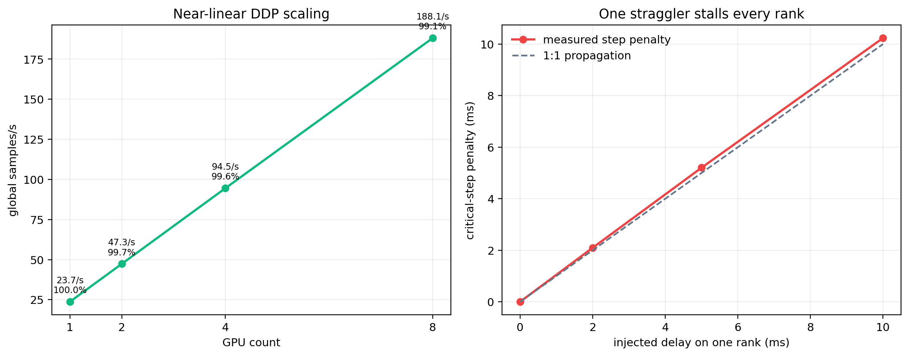

# EXP-INFRA-03：分组容量 MoE 多维证据与分布式瓶颈再评估

- 日期：2026-07-19
- 模型：v3，oc96-depth4、12 路由专家、top-2，约 4.11 M 参数
- 设备：单机 8×NVIDIA H800
- 软件：PyTorch 2.9.0+cu128、NCCL 2.27.5
- 权重：`models/Ours_v3_frozen/model_26.pth`，`strict=True` 加载
- 结果级别：性能为 S1 infra 基准；质量为冻结权重的 45 样本探针，不等同于重新训练后的最终质量
- 原始数据：`Materials/efficiency/data/*.json` 与 `Materials/efficiency/data/bottleneck/*.json`
- 复现实验：`script/benchmark_grouped_moe.py`、`script/evaluate_grouped_capacity.py`、`script/benchmark_nccl_allreduce.py`、`script/benchmark_ddp_training.py`、`script/benchmark_ddp_real_data.py`
- 汇总脚本：`script/summarize_bottleneck_evidence.py`
- 出图脚本：`script/make_efficiency_figures.py`

本实验回答两个问题：

1. 分组容量 MoE 的收益究竟来自哪里，是否只在某个孤立配置上有效，以及容量因子带来的性能、显存、丢弃和质量代价是什么；
2. 当前 4.11 M 参数模型的多卡瓶颈究竟是 NCCL 通信、负载不均，还是单卡计算/激活，并据此选择 DDP、分桶、FSDP/ZeRO 或专家并行。

---

## 1　实验设计与边界

**表 E3-1　测量口径**

| 实验 | 输入与权重 | 预热/测量 | 主要指标 |
|---|---|---|---|
| 单卡训练步 | 预训练权重；bs=10、170×170；完整前向、融合损失、反向、Adam | 5 步预热；3×20 步 | ms/step、samples/s、峰值显存 |
| 专家数扫描 | 与单卡相同；E∈{4,8,12,16,24,32} | 5 步预热；3×20 步 | sparse/grouped 交叉点 |
| 容量质量探针 | 冻结 `model_26.pth`；3 任务各 15 样本 | 单次确定性推理 | MI、SSIM、Qabf、VIF、Nabf、输出 MAE、路由丢弃率 |
| NCCL 微基准 | 4/8 卡；16 KiB–16 MiB all-reduce | 10 次预热；100 次 | p50/p95 延迟、算法/总线带宽 |
| DDP 独立重复 | 预训练权重；每卡 bs=10；完整损失；lr=0 | 每种模式 3 个新进程；15 步预热；80 步 | 均值、独立试验 95% CI |
| 桶级通信时间线 | timed async hook；CUDA Event 记录 ready/回调流完成上界；不导出 trace | 3×80 步；先按试验聚合 rank | 首末桶 ready、完成上界、梯度字节 |
| 通信边界/压力 | batch=1/2/5/10；额外串行 16 MiB all-reduce×0/1/4/16/64 | 12–15 步预热；60 步 | 计算—通信边界、反事实压力响应 |
| 真实数据 DDP | `MMFusionDataset`、DataLoader、真实三任务配额 | 12 步预热；50 步 | data wait、H2D、模型步、任务计数 |
| straggler 敏感性 | 单 rank 输入/GPU 停顿；物理卡重映射；成本分片 | 50–60 步 | 首梯度 ready、临界步额外耗时 |

**结果分析。** 性能实验使用真实模型、损失和反向图，仅将输入替换为固定随机张量，以隔离存储与 DataLoader 抖动；质量实验则使用真实融合样本。两者不能混为一谈：性能数据回答执行效率，冻结权重探针回答“切换 dispatch 后立即产生多大输出扰动”，不能替代按不同容量重新训练后的最终精度比较。

---

## 2　分组容量 MoE：机制与多维证据

### 2.1　为什么 grouped 必须与 compile 联合观察


稀疏路径逐专家执行 `nonzero → gather → 两层 linear → index_add`。它节省 FLOPs，却把一次 MoE 变成 E 组动态 shape 小算子。grouped 路径不改变 top-k 路由规则，而是将 `D=T·k` 个 dispatch 按专家排序，计算桶内位置，并写入 `[E, cap, C]` 固定容量缓冲；专家 FFN 因而变为两个批量 GEMM。固定形状本身会引入 padding，所以 grouped 的目标不是“无条件减少 eager 时间”，而是把图改造成编译器和 GPU 更容易处理的规则形状。

**表 E3-2　dispatch 形状与 torch.compile 的 2×2 交叉消融（vanilla attention，bs=10）**

| dispatch | 执行模式 | ms/step | 相对 sparse eager 加速 |
|---|---:|---:|---:|
| sparse | eager | 552.63 | 1.000× |
| grouped, α=1.25 | eager | 549.21 | 1.006× |
| sparse | compile | 473.40 | 1.167× |
| grouped, α=1.25 | compile | **427.47** | **1.293×** |

**结果分析。** grouped 单独只快 0.6%，说明“把 linear 换成 bmm”不是收益的充分条件；compile 单独快 16.7%；二者联合快 29.3%，且 grouped+compile 比 sparse+compile 再快 10.7%。这验证了创新点的核心不是改变 MoE 数学，而是改变执行形状，使编译器能融合外围点算子并减少 Python/launch 开销。用预训练权重复测时，sparse=474.05 ms、grouped α=1.25=427.11 ms，仍为 1.110×，排除了随机初始化造成偶然性能结论的可能。


### 2.2　算子结构是否真的发生改变

**表 E3-3　eager profile 的关键算子变化**

| 算子 | sparse：调用数 / CUDA 总时长 | grouped：调用数 / CUDA 总时长 | 结构变化 |
|---|---:|---:|---:|
| `aten::linear` | 1504 / 236.30 ms | 352 / 98.52 ms | 调用数 -76.6% |
| `aten::mm` | 3168 / 449.07 ms | 864 / 197.55 ms | 调用数 -72.7% |
| `AddmmBackward0` | 1344 / 435.38 ms | 192 / 183.88 ms | 调用数 -85.7% |
| `IndexBackward0` | 1200 / 100.06 ms | Top-20 中消失 | 稀疏索引反向被移出主路径 |
| `aten::bmm` | 488 / 231.81 ms | 776 / 746.32 ms | 规则批量 GEMM 成为主算子 |
| `aten::copy_` | 3372 / 138.38 ms | 3324 / 136.79 ms | 基本不变 |

**结果分析。** profile 直接证实：小 `linear/mm` 和索引反向显著减少，代价是 `bmm` 变成主算子。grouped eager 总步时与 sparse eager 接近，正是因为减少的 launch/index 时间被 padding 后的大 bmm 抵消；compile 能优化规则 bmm 周边图，才把结构变化兑现为墙钟收益。`copy_` 几乎不变，也说明下一轮若继续优化，应针对 gather/scatter 融合，而不是继续改专家 GEMM。

### 2.3　收益是否随专家数增长

**表 E3-4　专家数扫描（SDPA+compile，bs=10，α=1.25）**

| 路由专家 E | sparse ms | grouped ms | grouped 单步降幅 |
|---:|---:|---:|---:|
| 4 | 405.76 | 511.47 | -26.1%（更慢） |
| 8 | 437.64 | 436.78 | +0.2% |
| 12 | 470.78 | 427.35 | +9.2% |
| 16 | 505.50 | 428.63 | +15.2% |
| 24 | 595.99 | 426.86 | +28.4% |
| 32 | 683.39 | 435.80 | **+36.2%** |

**结果分析。** sparse 路径的 Python 循环和小 GEMM 数量随 E 近似增长；grouped 的两次批量 GEMM 数量不随 E 增长，主要变化是 batch 维。交叉点约在 E=8：少专家时 padding/排序成本不划算，E≥12 后收益稳定扩大，E=32 时单步降低 36.2%。因此该创新不是所有 MoE 的通用替换，而是面向“专家数较多、单专家矩阵较小”的执行优化。


### 2.4　容量因子的速度—显存代价

容量为

\[
\mathrm{cap}=\left\lfloor \alpha \frac{T k}{E}\right\rfloor ,
\]

其中 α 为容量因子。α 越小，规则缓冲越小、GEMM 越快，但热点专家更容易溢出；α 越大，输出越接近 sparse，但 padding、激活和显存同步增加。


**表 E3-5　固定 bs=10 的容量性能（预训练权重，SDPA+compile）**

| 配置 | ms/step | samples/s | 相对 sparse 吞吐 | 峰值显存 | 相对 sparse 显存 |
|---|---:|---:|---:|---:|---:|
| sparse | 474.05 | 21.095 | 1.000× | 61.32 GB | — |
| grouped α=1.00 | **393.16** | **25.435** | **1.206×** | 62.75 GB | +2.3% |
| grouped α=1.25 | 427.11 | 23.413 | 1.110× | 69.51 GB | +13.4% |
| grouped α=1.50 | 461.49 | 21.669 | 1.027× | 76.20 GB | +24.3% |

**结果分析。** α 每增加 0.25，固定容量缓冲近似线性增长，性能收益快速收窄。α=1.0 的速度最好，但后续质量表显示其丢弃率过高；α=1.25 保留 11.0% 吞吐收益，是性能与质量风险之间的激进甜点；α=1.5 仅剩 2.7% 吞吐收益，但输出更接近 sparse。α=2/4 在 bs=10 分别因下一笔 1.65 GiB/424 MiB 分配失败而 OOM，说明高容量不能只看数值等价。

**表 E3-6　各容量的最大已验证可运行 batch 与吞吐**

| 配置 | 最大已验证 bs | ms/step | samples/s | 峰值显存 | 相对 sparse 最大吞吐 |
|---|---:|---:|---:|---:|---:|
| sparse | 13 | 585.59 | 22.200 | 79.56 GB | 1.000× |
| grouped α=1.00 | 12 | 464.50 | **25.834** | 75.33 GB | **1.164×** |
| grouped α=1.25 | 11 | 463.89 | 23.713 | 76.42 GB | 1.068× |
| grouped α=1.50 | 10 | 461.49 | 21.669 | 76.20 GB | 0.976× |
| grouped α=2.00 | 8 | 427.95 | 18.694 | 71.57 GB | 0.842× |
| grouped α=4.00 | 4 | 344.67 | 11.605 | 57.20 GB | 0.523× |

**结果分析。** 用“最大 batch”衡量时，α=1.0/1.25 仍分别比 sparse 高 16.4%/6.8%；α≥1.5 则因容量缓冲挤占 batch 空间而失去系统吞吐优势。由此可见，容量不是越大越安全：高 α 虽减少 token 丢弃，却降低每卡有效样本数，最终使卡利用率变差。

### 2.5　容量是否损害冻结模型输出质量

**表 E3-7　45 样本冻结权重探针（3 任务各 15；Δ 均相对 sparse）**

| 配置 | dispatch 丢弃率 | 输出 MAE | ΔMI ↑ | ΔSSIM ↑ | ΔQabf ↑ | ΔVIF ↑ | ΔNabf ↓ |
|---|---:|---:|---:|---:|---:|---:|---:|
| α=1.00 | 6.748% | 2.63e-4 | -2.92e-2 | +1.15e-4 | -6.35e-5 | -1.40e-3 | -2.98e-4 |
| α=1.25 | 0.800% | 3.67e-5 | -5.71e-3 | +1.08e-5 | -7.02e-6 | -2.48e-4 | -4.73e-6 |
| α=1.50 | 0.121% | 3.13e-6 | -8.67e-4 | +3.11e-7 | -8.08e-7 | -3.20e-5 | +2.57e-5 |
| α=2.00 | 0.0039% | 7.82e-8 | +1.07e-5 | -9.17e-9 | +3.31e-8 | +6.64e-8 | +4.15e-7 |
| α=4.00 | 0% | 0 | 0 | 0 | 0 | 0 | 0 |

**结果分析。** 输出扰动随丢弃率单调下降。α=1.0 的 6.75% 丢弃已造成可见 MI/VIF 下降，不宜作为默认质量路径；α=1.25 的总体丢弃降至 0.80%，输出 MAE 仅 3.67e-5，五项指标变化很小，但个别层最大丢弃仍达 10.71%，仍需重新训练验证；α=1.5 基本贴近 sparse；α≥2 数值上等价，却不具备 bs=10 的显存可行性。建议将 α=1.25 作为速度档、α=1.5 作为保守档、sparse 作为零丢弃回退，而不是用一个容量覆盖所有场景。


---

## 3　分布式瓶颈：先判断通信是否值得优化

### 3.1　模型状态很小，显存瓶颈是激活而非参数

模型参数约 4.11 M，FP32 参数、梯度及 Adam 两个状态合计不足 0.1 GB，而实测峰值显存为 61–76 GB。也就是说，参数/优化器状态不到峰值的 0.2%，主要显存来自 170×170 多尺度激活、损失分支及 grouped 容量缓冲。

**表 E3-8　并行方案与当前瓶颈的匹配度**

| 方案 | 主要解决对象 | 当前模型判断 | 结论 |
|---|---|---|---|
| 纯 DDP | 样本并行；每卡完整副本 | 参数副本极小，通信量仅约 15.67 MiB 梯度 | **采用** |
| FSDP / ZeRO-2/3 | 切分参数、梯度、优化器状态 | 最多节省不足 0.1 GB，却新增 reduce-scatter/all-gather | **当前不采用** |
| Expert Parallel | 切分专家并做 token all-to-all | 仅 12 个小专家；会把本地 bmm 变成 A2A 延迟 | **当前不采用** |
| Tensor/Pipeline Parallel | 切分大层或深流水 | 层小且 depth=4，通信/气泡大于收益 | **当前不采用** |
| DDP 分桶 + contiguous grad | 在反向中异步 all-reduce | 代价小，且可避免梯度拷贝 | **采用并实测** |
| 固定 shape + 成本均衡分片 | 减少 rank straggler | DDP 临界路径由最慢 rank 决定 | **采用为数据侧原则** |

**结果分析。** 大模型框架中的 ZeRO/FSDP/EP 并非越多越先进。当前模型是“参数很小、激活很大”，切分模型状态几乎不释放可用 batch 空间，反而引入额外 collective。最合适的路线是保持纯 DDP，把优化集中在单卡执行、输入均衡和少量梯度通信上。

### 3.2　NCCL 链路处于什么状态

**表 E3-9　单机 H800 NCCL all-reduce（100 次；延迟取 p50）**

| payload | 4 卡 p50 | 4 卡 bus BW | 8 卡 p50 | 8 卡 bus BW |
|---:|---:|---:|---:|---:|
| 16 KiB | 38.8 μs | 0.35 GB/s | 39.5 μs | 0.70 GB/s |
| 1 MiB | 38.8 μs | 39.61 GB/s | 43.6 μs | 21.69 GB/s |
| 4 MiB | 58.4 μs | 104.85 GB/s | 69.2 μs | 84.94 GB/s |
| 8 MiB | 77.1 μs | 161.94 GB/s | 93.0 μs | 112.09 GB/s |
| 16 MiB | 115.1 μs | 217.62 GB/s | 135.1 μs | 186.61 GB/s |

**结果分析。** 小于 1 MiB 时几乎全是约 40 μs 固定延迟，拆成许多小桶会反复支付启动成本；4–16 MiB 后带宽快速爬升。当前完整梯度约 15.67 MiB，一次 all-reduce 的量级仅约 0.1–0.2 ms，远小于约 422 ms 的训练步，因此 NCCL 不是主瓶颈。分桶目标应是“至少两个足够大的桶以获得重叠机会”，而不是无限减小桶。


### 3.3　模型大小感知的 DDP 分桶


**表 E3-10　DDP-4 分桶扫描（其余配置固定）**

| `bucket_cap_mb` | 重建后桶数 | ms/step | samples/s | 相对 1 MiB |
|---:|---:|---:|---:|---:|
| 0.5 | — | 不支持 | — | PyTorch 首桶默认为 1 MiB，触发断言 |
| 1 | 15 | 427.75 | 93.512 | 1.000× |
| 2 | 8 | 426.36 | 93.817 | 1.003× |
| 4 | 4 | 426.23 | 93.847 | 1.004× |
| 8 | 2 | **425.57** | **93.993** | **1.005×** |
| 25 | 1 | 426.78 | 93.726 | 1.002× |

**结果分析。** 1 MiB 的 15 个 collective 受启动延迟拖累；25 MiB 大于模型全部梯度，只形成一个桶，失去反向重叠机会；8 MiB 恰好形成两个约 8.09/7.58 MiB 的高带宽桶，取得最优结果。在最终 `static_graph` 配置上，8 MiB 也从 423.20 ms 降到 422.32 ms（吞吐 +0.21%），两次独立实验方向一致。收益不大，是因为通信本来就很小，但该选择有明确机制而非经验猜值。


### 3.4　DDP 运行时消融

**表 E3-11　DDP-4 优化逐项消融（预训练权重）**

| 配置 | ms/step | global samples/s | 相对上一项 |
|---|---:|---:|---:|
| baseline：25 MiB、find-unused | 439.63 | 90.986 | — |
| + `gradient_as_bucket_view` | 437.70 | 91.388 | +0.44% |
| + fused Adam | 424.99 | 94.120 | +2.99% |
| + `static_graph`、关闭 unused 搜索 | 423.56 | 94.437 | +0.34% |
| + 8 MiB 两桶 | **422.32** | **94.716** | +0.30% |

**结果分析。** 总吞吐从 90.99 提升到 94.72 samples/s，累计 +4.10%。最大贡献来自 fused Adam，因为模型包含大量小参数张量；bucket view 的显存收益被 69 GB 级激活峰值淹没，但仍省去梯度到通信桶的拷贝；DDP 日志只发现 768 B unused 参数，且使用集合不随迭代改变，所以 `static_graph=True` 在当前图上可安全跳过每步图搜索。最终配置为 `gradient_as_bucket_view + fused Adam + static_graph + 8 MiB`。

**表 E3-12a　最终 8 MiB 两桶下的独立重复（均值±试验间标准差）**

| GPU 数 | noop | default | sync | default−noop | 差值 95% CI |
|---:|---:|---:|---:|---:|---:|
| 4 | 422.80±1.25 ms | 422.66±0.66 ms | 423.22±0.86 ms | -0.13 ms | [-3.98, 3.71] ms |
| 8 | 430.93±0.26 ms | 429.84±2.87 ms | 431.43±0.12 ms | -1.09 ms | [-7.79, 5.60] ms |

每个单元均来自 3 个独立 `torchrun` 进程，每次 80 个稳态步，而不是把同一进程内高度相关的 step 当作独立样本。两种卡数的 default−noop 均值为负且置信区间跨 0，不能解释为“负通信开销”，只能说明暴露成本小于运行漂移。同步 all-reduce 也没有造成数量级恶化。带 Python Future 回调和 CUDA Event 的 timed hook 会引入调度开销，只用于下表的时间定位，不参与最终吞吐比较。

**表 E3-12b　真实梯度桶的 CUDA Event ready—complete 时间线**

| GPU 数 | 梯度量/桶数 | 首桶 ready | 末桶 ready | 通信完成上界 | 末桶暴露上界 | step end |
|---:|---:|---:|---:|---:|---:|---:|
| 4 | 16.43 MB / 2 | 387.35 ms | 423.67 ms | 424.58 ms | **0.91 ms** | 425.34 ms |
| 8 | 16.43 MB / 2 | 388.11 ms | 425.34 ms | 431.75 ms | **6.41 ms** | 432.47 ms |

初版在 Future 回调中读取主机时钟，记录到的只是 GPU 工作提交时刻，不能证明 collective 已完成。修正版在 step 起点、bucket ready、回调流等待 NCCL 之后和 step 末尾记录 CUDA Event，并先在每个试验内聚合 rank，再以 3 个试验计算区间。首桶可与后续约 36–37 ms 反向计算重叠；末桶完成上界为 4 卡 0.91 ms、8 卡 6.41 ms。8 卡上界约占 timed 步时 1.48%，但仍包含 Future 回调调度；默认临界路径上的暴露成本仍应以表 E3-12a 的 default−noop 区间为准。

**表 E3-12c　计算强度边界（4 卡，梯度固定为 16.43 MB）**

| 每卡 batch | noop | default | default−noop |
|---:|---:|---:|---:|
| 1 | 85.91 ms | 86.85 ms | +0.94 ms（1.09%） |
| 2 | 120.78 ms | 120.32 ms | -0.46 ms |
| 5 | 239.60 ms | 238.45 ms | -1.14 ms |
| 10 | 423.36 ms | 422.71 ms | -0.65 ms |

若 NCCL 是主瓶颈，固定梯度量而减小 batch 应显著抬高通信占比。实际在最不利的 batch=1 也只有约 1.1%，batch≥2 后差值符号随噪声改变，说明当前 batch=10 远处于计算主导区。

### 3.5　反事实通信压力：系统能否检测到真正的 NCCL 瓶颈

关闭真实梯度归约后，在 backward 末尾串行注入全零缓冲区的 all-reduce，不再混入逐元素除法。该通信不能与计算重叠，构成“如果通信真的变大，步时会怎样”的受控反事实。

| 压力方式 | 串行字节/步 | 4 卡增量 | 8 卡增量 |
|---|---:|---:|---:|
| 单轮 16 MiB | 16 MiB | -0.17 ms | +1.71 ms |
| 单轮 64 MiB | 64 MiB | +0.10 ms | +2.39 ms |
| 单轮 256 MiB | 256 MiB | +0.73 ms | +3.24 ms |
| 16 MiB × 4 轮 | 64 MiB | -1.69 ms | +1.81 ms |
| 16 MiB × 16 轮 | 256 MiB | -0.36 ms | +3.96 ms |
| 16 MiB × 64 轮 | 1 GiB | +4.36 ms | +8.04 ms |

8 卡单轮 payload 随 16→64→256 MiB 单调增加，4 卡的小压力点仍被运行漂移覆盖，直到 1 GiB 才明显抬升。该曲线不用于拟合带宽；它证明测量流程并非“无论如何都测不出通信”，而是当前两个异步桶仍处于通信不主导区。


真实 DataLoader 也给出同一结论：4 卡 default/noop/timed 分别为 498.01/498.86/496.90 ms，8 卡 default/noop 为 429.30/429.04 ms。4 卡的约 75 ms 额外时间来自单 rank 输入侧慢点，三种通信模式都无法消除；若把它误算为 NCCL，将直接优化错对象。

---

## 4　如何让每张卡有效工作：扩展效率与 straggler

### 4.1　1/2/4/8 卡扩展

**表 E3-13　单机 DDP 强度不变扩展（每卡 bs=10）**

| GPU 数 | ms/step | global samples/s | 相对 1 卡扩展效率 |
|---:|---:|---:|---:|
| 1 | 421.37 | 23.732 | 100.00% |
| 2 | 422.63 | 47.323 | 99.70% |
| 4 | 423.20 | 94.519 | 99.56% |
| 8 | 425.22 | 188.138 | **99.08%** |

**结果分析。** 8 卡吞吐为单卡的 7.93×，扩展效率 99.08%。这与“当前小模型 DDP 严重通信受限”的旧判断相反：在固定输入、稳定图和单机 NVLink/NVSwitch 条件下，通信只使 8 卡单步比 1 卡增加 3.85 ms。当前优化重点应继续放在每卡计算和输入供给，而不是引入更复杂的模型并行。

### 4.2　最慢 rank 的 1:1 放大与物理慢卡

**表 E3-14a　只给一个 rank 注入 GPU 计算停顿**

| 注入停顿 | DDP-4 ms/step | 相对无停顿增加 |
|---:|---:|---:|
| 0 ms | 422.81 | 0 |
| 2 ms | 425.27 | +2.46 ms |
| 5 ms | 428.19 | +5.38 ms |
| 10 ms | 432.84 | +10.04 ms |

输入 sleep 与 GPU `_sleep` 两种注入都近似 1:1 进入全局临界步。更重要的是，同步后的 rank 结束时间差仍接近 0：其他 rank 已经在 collective 等待，尾部 CV 会把“共同等待”误判为均衡。因而新增的诊断信号是首梯度 bucket ready，而不是只记录 step end。

正常 8 卡映射中，物理 GPU7 连续三次比其余 rank 晚约 4–5 ms 产生首梯度。将可见卡顺序反转后，慢点从 local rank7 移到 local rank0，但仍落在物理 GPU7；NUMA 本地绑核后也不改变该归属。逐卡独立负载进一步给出：

**表 E3-14b　逐物理卡同负载训练步**

| GPU | 0 | 1 | 2 | 3 | 4 | 5 | 6 | 7 |
|---:|---:|---:|---:|---:|---:|---:|---:|---:|
| ms/step | 419.54 | 419.48 | 419.56 | 419.65 | 419.87 | 420.18 | 419.50 | **421.50** |

GPU7 比其余卡均值慢 1.82 ms（0.43%），且三次内部重复从 419.86 漂到 423.54 ms。其标称最大时钟、显存频率和 700 W 功率上限与其他卡相同，所以现有证据支持“物理卡运行态差异”，不支持“NCCL 或 rank7 逻辑特殊”。生产监控需保留物理 UUID、温度/时钟和首梯度时间的关联。



### 4.3　真实数据慢 rank：任务标签均衡的受控负结果

真实数据实验中，默认 `DistributedSampler + 4 workers/rank` 稳定出现约 498 ms 的临界步，而合成固定输入只有约 423 ms。显式 DataLoader wait 低于 0.4 ms，不代表输入侧没有问题：worker 在后台解码、YCbCr 转换、尺寸对齐和预取，会与训练主线程并发竞争 CPU。

三任务实际样本数为 3894/3249/3468。受控复测中，前 500 个样本的任务计数在四个 rank 上分别为：

```
rank0 [186, 172, 142]   rank1 [187, 157, 156]
rank2 [189, 157, 154]   rank3 [171, 163, 166]
```

反转 GPU 映射后慢点仍留在 rank0，排除了物理 GPU0，但任务计数偏斜是否构成临界路径仍需受控对照。

初版原型把所有任务截到最小长度后再等量切分，改变了全局样本集合和任务先验，因此其 14.69% 提升无效。修正版从与 `DistributedSampler` 相同的全局随机序列出发，仅在每个 40 样本全局 batch 内重新分配 rank；逐步断言两种策略的样本集合和全局任务计数完全一致。修正版把三任务的 rank 间计数跨度从 18/15/24 降到 4/4/5，不再截断较大任务。

**表 E3-15a　DataLoader 与采样优化（3 次独立试验）**

| 配置 | DDP-4 临界步 | 相对默认 4 workers |
|---|---:|---:|
| 1 worker/rank | 424.44±2.35 ms | 步时 -14.50% |
| 4 workers/rank，默认 sampler（受控复测） | 496.43±1.51 ms | 基线 |
| 4 workers + trainer/worker 隔核 | 490.57±0.18 ms | 步时 -1.18% |
| 4 workers + **同样本任务均衡** | 496.84±0.71 ms | 步时 **+0.08%** |
| 8 workers/rank | 424.38±0.87 ms | 步时 -14.51% |

三次配对的“任务均衡−默认”差值为 +0.41 ms，95% CI 为 [-1.85, 2.68] ms，没有可辨认收益。任务计数虽更均匀，却不是当前固定形状数据的成本代理。1 或 8 workers/rank 都明显快于 4 workers/rank，说明现有约 72 ms 慢点更可能来自 worker 数、预取和进程竞争的非单调交互；单纯隔核也只回收约 5.9 ms。任务均衡原型不应并入正式训练。

相同总成本的控制注入给出边界条件：将 20 ms 输入成本集中到一个 rank 时为 441.75 ms，均分到四个 rank 时为 428.21 ms，回收 13.54 ms，即消除 73.9% 的人为偏斜损失。因此成本异构真实存在时，均衡分配有效；但必须用 `分辨率/解码类型/历史 EMA 耗时` 等可验证成本特征，而不能把任务标签直接当作成本。


### 4.4　路由不均是否会变成 rank 不均

**表 E3-15b　任务布局与 dispatch 形状**

| dispatch | balanced tasks | rank-homogeneous tasks | 差值 |
|---|---:|---:|---:|
| sparse | 469.53 ms | 470.30 ms | +0.77 ms |
| grouped α=1.25 | 424.97 ms | 424.27 ms | -0.70 ms |

rank-homogeneous 布局把路由 load CV 拉到 0.136–0.171，丢弃率也从约 0.2% 到 1.1% 不等，但 grouped 的 `[E, cap, C]` 主 GEMM 形状不变，未形成显著慢 rank。grouped 在 balanced 布局下仍比 sparse 降低 9.49% 步时。因此固定容量既是 compile 友好形状，也是路由侧的计算量隔离器；当前慢 rank 来自物理卡和数据预处理，不需要引入 Expert Parallel all-to-all。

---

## 5　与开源训练框架的对照及取舍

PyTorch DDP、Megatron-Core 和 DeepSpeed 的共同思想都是：用连续梯度缓冲与分桶启动异步 collective，使通信和反向计算重叠；Megatron 进一步用 distributed optimizer、reduce-scatter/all-gather 以及 EP all-to-all 支撑大模型。将这些机制映射到当前模型后，结论如下。

**表 E3-16　开源框架机制迁移判断**

| 框架机制 | 可借鉴部分 | 本项目取舍 |
|---|---|---|
| PyTorch DDP bucket reducer | 按梯度 ready 顺序分桶；`gradient_as_bucket_view`；`static_graph` | 已落地并实测，8 MiB 两桶最优 |
| Megatron `overlap_grad_reduce` | 异步梯度归约与 backward 重叠 | DDP 默认 reducer 已提供同类能力 |
| Megatron distributed optimizer / `overlap_param_gather` | 切分状态并把参数 all-gather 与 forward 重叠 | 参数仅约 16 MB，不值得增加 param gather |
| Megatron EP A2A overlap | 将 token all-to-all 与相邻微批计算重叠 | 当前专家小且单卡可容纳，EP 不合算 |
| DeepSpeed ZeRO-1/2/3 | 依次切分 optimizer、gradient、parameter | 当前峰值由激活主导，暂不采用 |
| 通信压缩（fp16/bf16 hook） | 减少跨节点梯度字节 | 单机通信已低于噪声，且本负载 bf16 曾显著变慢，暂不采用 |

**结果分析。** 本项目吸收的是“分桶、连续缓冲、静态图、异步归约”的方法，而不是照搬框架的全部并行维度。只有当模型参数、专家数或节点数扩大到使通信暴露显著上升时，才应重新评估 ZeRO/FSDP/EP；当前直接引入会优化错误的瓶颈。

官方依据：

- [PyTorch DistributedDataParallel](https://docs.pytorch.org/docs/stable/generated/torch.nn.parallel.DistributedDataParallel.html)：`bucket_cap_mb`、`gradient_as_bucket_view`、`static_graph` 的语义；
- [Megatron-Core MoE](https://docs.nvidia.com/megatron-core/developer-guide/latest/user-guide/features/moe.html)：DP 梯度重叠、参数 gather 重叠和 EP A2A 重叠；
- [DeepSpeed ZeRO](https://deepspeed.readthedocs.io/en/latest/zero3.html)：optimizer/gradient/parameter 三阶段切分；
- [GShard](https://arxiv.org/abs/2006.16668)：固定 expert capacity、overflow token 和负载均衡损失。

---

## 6　结论、推荐配置与限制

1. **分组容量 MoE 的已证收益不是孤立数字。** 它把动态的 E 路小算子改成固定容量批量 GEMM；收益需要 compile 才兑现，并随专家数增长：E=12/16/24/32 的单步降幅为 9.2%/15.2%/28.4%/36.2%。
2. **容量因子是系统—质量联合旋钮。** α=1.25 在预训练权重上带来 1.110× 单卡吞吐、0.80% dispatch 丢弃和 3.67e-5 输出 MAE；α=1.5 更接近 sparse，但只剩 1.027×，且显存升至 76.2 GB。
3. **当前多卡不是通信受限。** 16.43 MB 梯度形成两个桶，CUDA Event 末桶完成上界为 4 卡 0.91 ms、8 卡 6.41 ms；default−noop 的独立试验 95% 区间跨 0，1→8 卡扩展效率为 99.08%。只有人为放大串行通信后，步时响应才清晰。
4. **分布式主要风险是最慢 rank。** GPU 停顿近似 1:1 传播；物理 GPU7 比其余卡均值慢 0.43%；4 workers/rank 还可制造约 72 ms 的输入侧慢点。但同样本任务均衡为 496.84 vs 496.43 ms，没有收益；任务标签不是当前成本代理。
5. **推荐训练配置。** 性能档采用 `grouped α=1.25 + SDPA + compile + DDP + gradient_as_bucket_view + fused Adam + static_graph + bucket_cap_mb=8`；数据侧先调 worker/预取拓扑，只有观测到稳定成本异构后再试成本感知分配；质量保守档采用 α=1.5，零丢弃要求下回退 sparse。

限制必须明确：

- 质量结果是冻结权重的 45 样本探针，不是 α=1.25/1.5 独立训练后的统计显著性结论；
- 所有分布式数据来自单机 NVLink/NVSwitch，不能外推到跨节点 IB；
- noop/default/sync 差异的置信区间跨 0；CUDA Event 完成时刻仍包含 Future 回调调度，本文只报告上界，不报告不可靠的“通信隐藏百分比”；
- 任务均衡采样器目前只完成 50 步性能探针，受控结果为中性，故不建议正式采用；
- 尚未实现自定义 Triton gather/scatter；profile 显示 copy 基本未下降，这是下一轮单卡优化空间。

