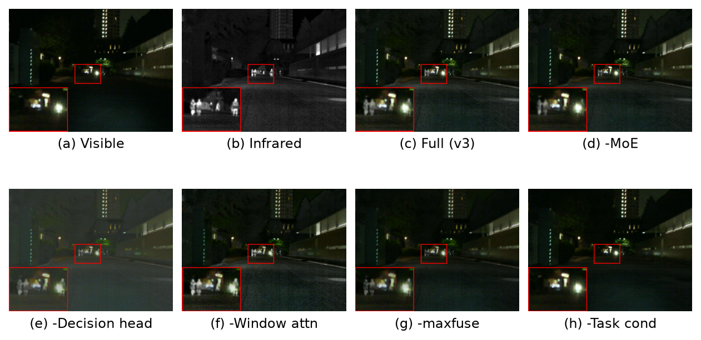
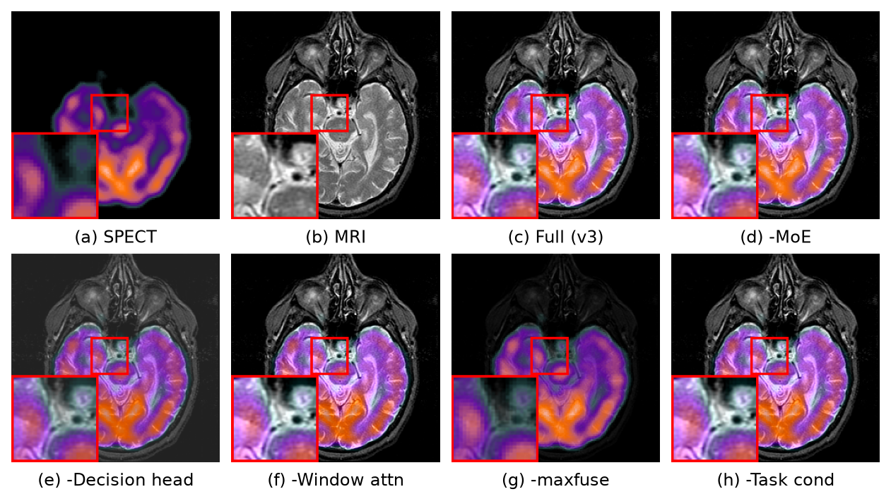
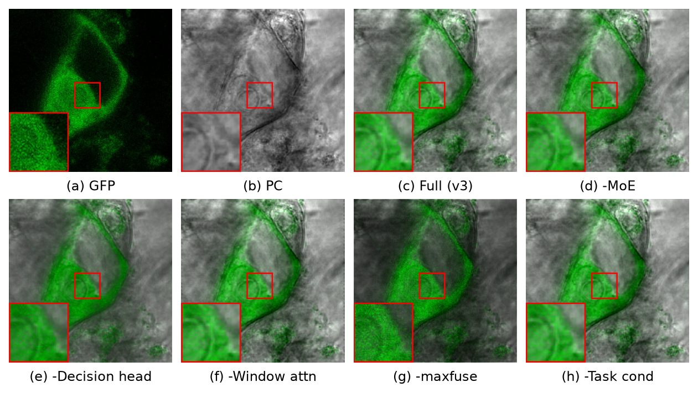

# 4.3　消融实验

为验证本文各**创新点**的有效性，以完整模型 v3 为基线，每次**只移除一个创新点**、其余设置全同，重新训练 20 epoch 后在三个模态测试集上评测。本节仅针对创新点做消融；各**超参数**的取值分析（如窗口大小 ws、深度 depth、路由专家数 n_routed 等）另见 §4.4 超参数分析，二者不混。

本文共 5 个创新点，消融方式如表 4-9 所示：

**表 4-9　创新点与消融方式**

| 编号 | 创新点 | 作用 | 消融（移除）方式 |
|---|---|---|---|
| I1 | **MoE 混合专家 FFN**（1 共享 + 12 路由，top-2） | 多任务/模态特化 | 去掉路由专家（−MoE） |
| I2 | **决策图融合头** `F = w·A+(1−w)·B` | 凸组合，保对比度与双源互信息 | 改为网络直接回归融合图（−Decision head） |
| I3 | **真实窗口注意力**（ws=8） | 跨窗空间上下文建模 | 退化为逐像素 ws=1（−Window attn） |
| I4 | **maxfuse 任务自适应损失** | 朝逐像素 max 对齐，保强结构/对比 | 改回 GFP 标定的对称损失（−maxfuse） |
| I5 | **任务条件路由** | 路由注入任务嵌入，按任务特化专家 | 路由不注入任务嵌入（−Task cond） |

## 4.3.1　客观分析

三个模态上完整模型与各消融变体的 5 项指标结果如表 4-10 至表 4-12 所示（↑ 越大越好，Nabf ↓ 越小越好）。

**表 4-10　IR-VIS（n=50）创新点消融**

| 配置 | MI ↑ | SSIM ↑ | Qabf ↑ | VIF ↑ | Nabf ↓ |
|---|---|---|---|---|---|
| **完整 v3** | 5.200 | 0.724 | 0.646 | 0.106 | 0.026 |
| −MoE | 5.464 | 0.721 | 0.628 | 0.135 | 0.022 |
| −Decision head | 3.552 | 0.560 | 0.377 | 0.061 | 0.004 |
| −Window attn | 2.756 | 0.700 | 0.480 | 0.048 | 0.096 |
| −maxfuse | 2.290 | 0.733 | 0.319 | 0.046 | 0.009 |
| −Task cond | 6.000 | 0.715 | 0.612 | 0.191 | 0.010 |

**表 4-11　医学（n=48）创新点消融**

| 配置 | MI ↑ | SSIM ↑ | Qabf ↑ | VIF ↑ | Nabf ↓ |
|---|---|---|---|---|---|
| **完整 v3** | 4.556 | 0.726 | 0.691 | 0.111 | 0.022 |
| −MoE | 4.583 | 0.725 | 0.688 | 0.165 | 0.019 |
| −Decision head | 3.285 | 0.289 | 0.462 | 0.060 | 0.002 |
| −Window attn | 4.250 | 0.732 | 0.703 | 0.124 | 0.013 |
| −maxfuse | 3.689 | 0.667 | 0.201 | 0.086 | 0.001 |
| −Task cond | 3.851 | 0.736 | 0.676 | 0.104 | 0.010 |

**表 4-12　显微 GFP–PC（n=30）创新点消融**

| 配置 | MI ↑ | SSIM ↑ | Qabf ↑ | VIF ↑ | Nabf ↓ |
|---|---|---|---|---|---|
| **完整 v3** | 5.445 | 0.538 | 0.680 | 0.135 | 0.060 |
| −MoE | 4.841 | 0.537 | 0.672 | 0.118 | 0.053 |
| −Decision head | 3.908 | 0.515 | 0.506 | 0.076 | 0.007 |
| −Window attn | 4.147 | 0.535 | 0.646 | 0.092 | 0.065 |
| −maxfuse | 2.061 | 0.467 | 0.398 | 0.048 | 0.022 |
| −Task cond | 5.436 | 0.538 | 0.679 | 0.156 | 0.059 |

**读表说明。** 与 §4.2 的 SOTA 对比不同，消融判优不能只看单个指标的高低：个别消融会在**某一任务的某一指标**上虚高，却以牺牲跨任务平衡、结构或伪影抑制为代价。完整 v3 是**综合最优的均衡配置**，移除任一创新点都会破坏整体三任务质量。

**结果分析。**

1. **决策图融合头（I2）—— 最关键。** 移除后（网络直接回归融合图）三模态全面崩塌：MI 在 IR-VIS 由 5.200→3.552、GFP–PC 由 5.445→3.908，医学 SSIM 由 0.726 骤降至 0.289（结构塌陷），Qabf 在 IR-VIS 由 0.646→0.377。其 Nabf 反而降到近 0，是因为输出退化为低对比度的均值图（无边缘可转移）。这证明「决策图凸组合 `F=w·A+(1−w)·B`」是本方法保留双源信息与动态范围的根本机制。

2. **maxfuse 损失（I4）—— 次关键。** 移除后（改回 GFP 标定的对称损失）信息与边缘同样大幅塌陷：MI 在 IR-VIS 由 5.200→2.290、GFP–PC 由 5.445→2.061，Qabf 在医学由 0.691→0.201。融合图对比度与锐度显著下降（主观上呈颗粒噪声/结构被淹没，见 §4.3.2）。

3. **真实窗口注意力（I3）—— 对 IR-VIS 关键。** 退化为逐像素（ws=1）后，IR-VIS 的 MI 由 5.200→2.756、Qabf 由 0.646→0.480、Nabf 由 0.026 升至 0.096（伪影增多）；医学上则基本持平。说明窗口注意力提供的空间上下文对复杂 IR-VIS 场景的结构与去伪影至关重要。

4. **MoE（I1）与任务条件路由（I5）—— 保障跨任务均衡。** 二者的移除会在单一任务的单一指标上「虚高」却损害整体：−Task cond 使 IR-VIS 的 MI/VIF 冲高到 6.000/0.191，却令医学 MI 由 4.556 跌到 3.851——即失去任务条件后，共享专家过度偏向占优的 IR-VIS 任务而干扰其它任务；−MoE 则令 GFP–PC 的 MI 由 5.445 掉到 4.841。完整模型以少量单任务峰值换取三任务的均衡领先，直接印证了「MoE 任务特异路由抑制任务干扰」的设计动机。

**重要性排序：决策图头 ≫ maxfuse ≈ 窗口注意力 > 任务条件路由 ≈ MoE。** 去掉任一创新点都掉点，完整 v3 是各创新点的联合最优。

## 4.3.2　主观分析

三个模态上完整模型与各消融变体的定性对比如图 4-5 至图 4-7 所示（2×4 排布，每个面板红框 + 左下角局部放大；彩色显示同 §4.2）。

**图 4-5　IR-VIS 创新点消融定性对比（样本 00778N）**

**图 4-6　医学 SPECT–MRI 创新点消融定性对比（样本 spect_18017）**

**图 4-7　显微 GFP–PC 创新点消融定性对比（样本 05-A02）**

**主观分析（与客观结果一致）。**

- **完整 v3（c）**：功能信息（红外热目标 / SPECT 代谢色 / GFP 荧光）与结构细节保留均衡、对比度适中、边缘干净。
- **−Decision head（e）**：整体对比度下降、发暗，功能信息被弱化（荧光/伪彩变淡），结构源过度主导，与 MI/SSIM 的塌陷一致。
- **−maxfuse（g）**：最明显的退化——呈颗粒噪声与过饱和的弥散色块，医学图中 MRI 结构细节被色块淹没、GFP 图荧光变噪，与其 MI/Qabf 的大幅下降对应。
- **−Window attn（f）**：IR-VIS 场景出现斑块与伪影（Nabf 升高），细节不如完整模型干净。
- **−MoE（d）/−Task cond（h）**：整体接近完整模型，但在功能区分布与跨模态一致性上存在细微退化（如 −Task cond 荧光/热目标偏移），与其「破坏跨任务均衡」的客观表现一致。

综上，主客观分析一致表明：本文的 5 个创新点各有正向贡献，其中决策图融合头与 maxfuse 损失最为关键，完整 v3 为联合最优配置。
