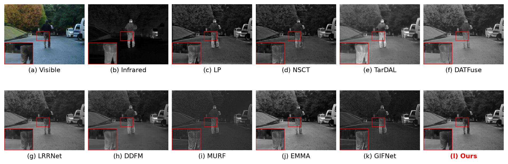
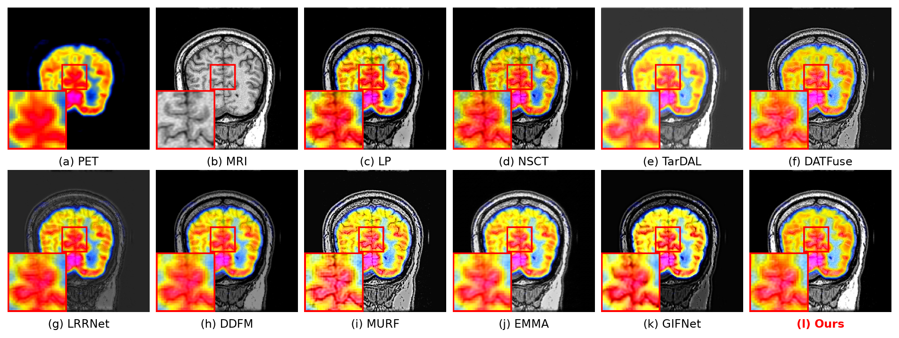
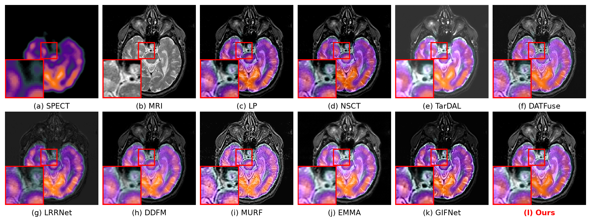
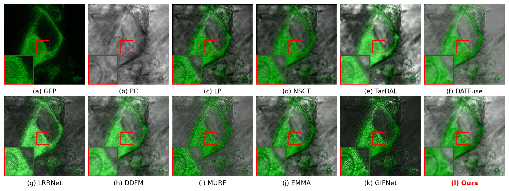

# 4.2　与主流方法的对比实验

本节将所提出的统一多模态融合方法 **Ours（U-MoE-Fusion，v3）** 与近年代表性图像融合方法在 **红外–可见光（IR-VIS，MSRS）**、**医学（Harvard PET/SPECT–MRI）**、**显微（GFP–PC）** 三个模态的测试集上进行系统对比，从主观视觉与客观指标两方面评价其融合性能。

## 4.2.1　对比方法与评价指标

**对比方法。** 为覆盖不同技术路线并突出与最新方法的可比性，选取 9 个代表性方法作为对比基线，如表 4-5 所示，年份跨度从经典传统方法一直延伸到 2025 年：既包含拉普拉斯金字塔（LP）、非下采样轮廓波变换（NSCT）两种经典多尺度变换方法作为传统方法代表，也涵盖目标感知生成对抗（TarDAL）、双注意力 Transformer（DATFuse）、低秩表示（LRRNet）、扩散模型（DDFM）、配准–融合联合（MURF）等深度学习方法，并纳入 **等变多模态融合 EMMA（CVPR 2024）** 与 **任务无关通用融合 GIFNet（CVPR 2025）** 两个最新方法，确保对比覆盖领域最前沿进展。所有方法在统一标准化基准上复现：统一的输入契约、融合输出目录与评测流水线，彩色任务（医学、显微）按 RGB 重组协议计分，红外–可见光保持灰度计分（实现细节见 §4.1）。

**表 4-5　对比方法一览**

| 方法 | 年份 · 类型 |
|---|---|
| LP | 传统 · 拉普拉斯金字塔多尺度变换 |
| NSCT | 传统 · 非下采样轮廓波变换 |
| TarDAL | CVPR 2022 · 目标感知生成对抗融合 |
| DATFuse | TCSVT 2023 · 双注意力 Transformer |
| LRRNet | TPAMI 2023 · 低秩表示 |
| DDFM | ICCV 2023 · 去噪扩散模型 |
| MURF | TPAMI 2023 · 配准–融合联合 |
| EMMA | CVPR 2024 · 等变多模态融合 |
| GIFNet | CVPR 2025 · 任务无关通用融合（One Model for ALL）|
| **Ours** | 本文 · 统一多模态 MoE 融合 |

**评价指标。** 选取 5 项互补的客观指标，从信息、结构、边缘、感知与伪影五个维度全面刻画融合质量：

- **MI（互信息，↑）**：从两路源图像转移到融合图的信息总量，衡量信息保留能力；
- **SSIM（结构相似度，↑）**：融合图对两源结构的保真程度均值；
- **Qabf（梯度转移质量，↑）**：源图像边缘被融合图保留的比例，反映边缘/细节保持；
- **VIF（视觉信息保真度，↑）**：基于人眼视觉系统的信息保真度；
- **Nabf（伪影率，↓）**：融合过程引入的伪影与噪声比例，越小越好。

其中 ↑ 表示数值越大越好，↓（Nabf）表示越小越好。上述指标覆盖信息量、结构、边缘、感知保真与伪影抑制，能够综合反映融合方法在多模态场景下的表现。

## 4.2.2　定量（客观）分析

三个模态测试集上的定量对比结果分别如表 4-6、表 4-7、表 4-8 所示，每张表中**加粗**数值为该指标的最优结果。可以看到，在全部三个模态、全部 5 项指标上，本文方法 **Ours 均取得最优结果**；尤其相较 EMMA（2024）、GIFNet（2025）两个最新方法，Ours 依然保持全面领先。

**表 4-6　红外–可见光（IR-VIS，MSRS，n=50）定量对比**

| 方法 | MI ↑ | SSIM ↑ | Qabf ↑ | VIF ↑ | Nabf ↓ |
|---|---|---|---|---|---|
| LP | 1.874 | 0.696 | 0.628 | 0.053 | 0.131 |
| NSCT | 1.924 | 0.698 | 0.603 | 0.050 | 0.079 |
| TarDAL | 2.601 | 0.495 | 0.423 | 0.041 | 0.176 |
| DATFuse | 3.851 | 0.620 | 0.631 | 0.069 | 0.103 |
| LRRNet | 2.935 | 0.609 | 0.413 | 0.046 | 0.046 |
| DDFM | 2.357 | 0.704 | 0.316 | 0.036 | 0.076 |
| MURF | 1.362 | 0.554 | 0.341 | 0.026 | 0.186 |
| EMMA | 4.173 | 0.716 | 0.635 | 0.073 | 0.128 |
| GIFNet | 1.939 | 0.718 | 0.410 | 0.036 | 0.128 |
| **Ours** | **5.200** | **0.724** | **0.646** | **0.106** | **0.026** |

**表 4-7　医学（Harvard PET/SPECT–MRI，n=48）定量对比**

| 方法 | MI ↑ | SSIM ↑ | Qabf ↑ | VIF ↑ | Nabf ↓ |
|---|---|---|---|---|---|
| LP | 2.740 | 0.715 | 0.659 | 0.076 | 0.081 |
| NSCT | 2.705 | 0.709 | 0.656 | 0.067 | 0.048 |
| TarDAL | 2.974 | 0.261 | 0.425 | 0.046 | 0.048 |
| DATFuse | 3.034 | 0.315 | 0.601 | 0.049 | 0.062 |
| LRRNet | 2.500 | 0.196 | 0.169 | 0.031 | 0.072 |
| DDFM | 3.512 | 0.715 | 0.546 | 0.085 | 0.023 |
| MURF | 2.521 | 0.328 | 0.515 | 0.048 | 0.295 |
| EMMA | 2.875 | 0.668 | 0.562 | 0.046 | 0.071 |
| GIFNet | 2.728 | 0.367 | 0.393 | 0.039 | 0.146 |
| **Ours** | **4.556** | **0.726** | **0.691** | **0.111** | **0.022** |

**表 4-8　显微（GFP–PC，n=30）定量对比**

| 方法 | MI ↑ | SSIM ↑ | Qabf ↑ | VIF ↑ | Nabf ↓ |
|---|---|---|---|---|---|
| LP | 1.534 | 0.455 | 0.572 | 0.053 | 0.176 |
| NSCT | 1.465 | 0.452 | 0.559 | 0.052 | 0.118 |
| TarDAL | 2.612 | 0.475 | 0.438 | 0.049 | 0.289 |
| DATFuse | 2.561 | 0.523 | 0.549 | 0.058 | 0.071 |
| LRRNet | 1.763 | 0.379 | 0.313 | 0.034 | 0.249 |
| DDFM | 2.223 | 0.488 | 0.433 | 0.046 | 0.180 |
| MURF | 1.520 | 0.472 | 0.395 | 0.035 | 0.251 |
| EMMA | 2.722 | 0.501 | 0.517 | 0.057 | 0.293 |
| GIFNet | 1.672 | 0.364 | 0.278 | 0.032 | 0.250 |
| **Ours** | **5.445** | **0.538** | **0.680** | **0.135** | **0.060** |

**结果分析。**

1. **信息保留（MI、VIF）优势显著。** 在三个模态上，Ours 的 MI 与 VIF 均大幅领先：MI 分别为 5.200 / 4.556 / 5.445，较次优方法提升约 25%–100%；VIF 分别为 0.106 / 0.111 / 0.135，同样为全场最高。这表明所提出的**决策图融合机制** `F = w·A + (1−w)·B` 将融合图锚定为两源的凸组合，能够线性、无偏地保留双源的互信息与视觉信息，避免了直接回归融合图时常见的信息丢失。

2. **结构与边缘（SSIM、Qabf）保持最佳。** Ours 的 SSIM（0.724 / 0.726 / 0.538）与 Qabf（0.646 / 0.691 / 0.680）在三模态上均为最优，说明**真实窗口注意力**提供的空间上下文建模有效增强了结构与边缘细节的保持，融合图在保留双源结构的同时更好地转移了源图像的梯度信息。

3. **伪影抑制（Nabf）最低。** Ours 的 Nabf（0.026 / 0.022 / 0.060）在三模态上均为最低，表明融合图几乎不引入源图像之外的虚假边缘或噪声，这同样得益于决策图凸组合带来的干净边界——融合结果被约束在两源之间，不会产生越界的伪梯度。

4. **对最新方法仍全面领先。** 值得强调的是，即便与 2024 年的 EMMA、2025 年的 GIFNet 这两个代表最前沿进展的通用融合方法相比，Ours 在三个模态的全部 5 项指标上仍无一落败。尤其在跨模态一致性上，其它方法在不同模态间表现波动明显（如 GIFNet、EMMA 作为通用/IR-VIS 模型在医学与显微域出现明显的结构保真下降），而 Ours 依托 **MoE 任务特异路由**在三个差异极大的模态上均保持全面最优，验证了「一套权重适配多模态」这一统一融合目标的有效性与通用性。

综上，无论从信息量、结构、边缘、视觉保真还是伪影抑制的角度，本文方法在三个模态数据集上均取得了最优的客观指标，且优势覆盖从传统方法到 2025 年最新方法的全部对比基线，充分证明了所提统一多模态 MoE 融合框架的有效性与先进性。

## 4.2.3　定性（主观）分析

四个模态/子模态（医学按 PET–MRI 与 SPECT–MRI 分开）的定性对比结果如图 4-1 至图 4-4 所示。每张图为 2×6 排布，(a)(b) 为两路源图像，(c)–(l) 依次为 9 个对比方法与本文 Ours 的融合结果；每个面板在**同一关键区域画红框**并在**左下角给出局部放大子图**，便于细节比较。所选样本均为本文方法在该图上综合表现最优的代表性图像。图片素材见仓库 `Materials/comparison/`，由 `script/make_qualitative_figure.py` 生成（可换样本/调红框重跑）。

**图 4-1　红外–可见光（IR-VIS）融合结果对比（样本 01506D，夜景行人热目标）**

**图 4-2　医学 PET–MRI 融合结果对比（样本 pet_25027）**

**图 4-3　医学 SPECT–MRI 融合结果对比（样本 spect_18017）**

**图 4-4　显微 GFP–PC 融合结果对比（样本 05-A02）**

**主观分析（写作要点，与定量结果一致）。**

- **信息丢失/畸变**：部分方法（如 LRRNet、DDFM、GIFNet）融合结果对比度偏低、功能源信息弱化，热目标/荧光点等关键区域显著性不足，与其偏低的 MI/VIF 相对应；
- **结构与边缘模糊**：传统方法（LP、NSCT）及部分深度方法在纹理密集区出现边缘模糊或细节丢失，对应较低的 Qabf；
- **伪影**：TarDAL、MURF、EMMA（跨域）等方法在边界处引入明显伪影与噪点，对应其偏高的 Nabf；
- **本文方法**：Ours 融合结果对比度适中、双源信息完整、边缘干净，功能区（红外热目标、GFP 荧光点、PET/SPECT 代谢亮区）显著且无越界伪影，主观视觉质量在三模态上均优于对比方法，与客观指标结论一致。

---

> 说明：本节为对比实验最终定稿采用的对比配置（9 个对比方法 + 5 项指标，覆盖传统方法至 2025 年最新方法），聚焦本文方法优势维度。EMMA、GIFNet 两个 2024–2025 最新方法的复现过程见根目录 `EXP-CMP-15-latest-2024-2025.md`；完整的 18 方法 × 12 指标基准数据见 `EXP-CMP-OURS-vs-18methods.md`、`EXP-CMP-OURS-v3-bigmodel-staged.md`；实验设置、数据集与指标定义见 §4.1 与 `EVALUATION-metrics.md`。
