# 4.5　训练效率与分布式优化

本文方法只有约 4.11 M 参数，但 170×170 多尺度特征、12 路由专家 top-2 以及多分支融合损失使训练峰值显存达到 61–76 GB。因而，“参数少”不等于“训练开销小”。本节遵循“**profile 定位—执行形状改造—质量约束—分布式临界路径验证**”的顺序：先确认瓶颈，再解释 torch.compile、SDPA 和分组容量 MoE 三项单卡创新为何有效，最后用 NCCL、DDP 分桶、1/2/4/8 卡扩展和 straggler 对照重新判断分布式瓶颈。

除特别说明外，实验在单机 8×NVIDIA H800、PyTorch 2.9.0+cu128、NCCL 2.27.5 上完成；单卡采用 batch=10、170×170 输入，5 步预热后做 3×20 步；关键 DDP 结论采用 3 次独立进程、每次 15 步预热后测 80 步，敏感性实验测 50–60 步。性能实验严格加载冻结权重 `model_26.pth`，学习率置零以消除权重漂移，但保留完整前向、融合损失、反向和优化器。完整实验记录及原始 JSON 见 `../EXP-INFRA-03-grouped-moe-ddp-evidence.md` 和 `../Materials/efficiency/data/`。

## 4.5.1　profile 先行：瓶颈是执行碎片而非参数通信

原始 sparse MoE 对每个专家分别执行 `nonzero → gather → FC1 → GELU → FC2 → index_add`，造成大量动态 shape 小算子。表 4-15 给出同一训练步的关键 profile。

**表 4-15　sparse MoE 关键算子 profile**

| 算子 | 调用数 | CUDA 总时长 | 瓶颈来源 |
|---|---:|---:|---|
| `aten::linear` | 1504 | 236.30 ms | 多尺度、逐专家小 linear |
| `aten::mm` | 3168 | 449.07 ms | 小矩阵前向与反向 |
| `AddmmBackward0` | 1344 | 435.38 ms | 专家 FFN 反向 |
| `IndexBackward0` | 1200 | 100.06 ms | top-k gather/index 反向 |
| `aten::copy_` | 3372 | 138.38 ms | dispatch gather/scatter |
| `aten::bmm` | 488 | 231.81 ms | 注意力及其他批量矩阵乘 |

> **表注｜表 4-15。** 该表用调用次数和 CUDA 累计时长定位原始 sparse MoE 的主要开销；各算子可能嵌套，时长不能直接相加为单步时间。（小白版：慢点不在“模型太大”，而在许多小计算和搬运被反复执行，像为了搬一箱货来回跑了几千趟。）

**结果分析。** 热点不是 4.11 M 参数本身，而是“数千次小 GEMM + 动态索引 + kernel launch”。这决定了优化方向：减少中间张量与 launch、将动态专家执行改造成规则批量 GEMM，而不是直接套用面向大参数模型的 ZeRO/张量并行。

## 4.5.2　三项单卡创新及其耦合关系

### 4.5.2.1　torch.compile：收益取决于图是否规则

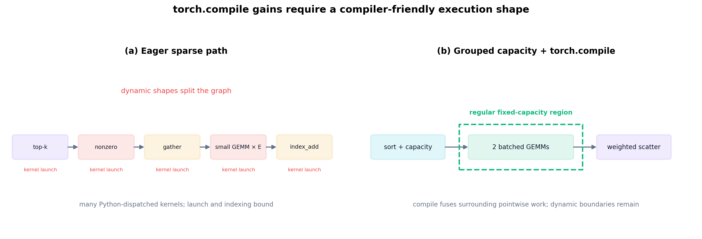

> **图注｜torch.compile 原理图。** 图中对比 eager 模式逐算子启动与 compile 模式的融合执行；只有形状稳定的区域才能被可靠编译和融合。（小白版：原来每个小步骤都要单独下命令，compile 会把连续且固定的步骤打包成一次完成。）

torch.compile 可以融合相邻 pointwise 算子并降低 Python/launch 开销，但无法凭空消除数据依赖的动态 shape。为区分“编译器收益”和“dispatch 形状收益”，本文做 2×2 交叉消融。

**表 4-16　dispatch×compile 交叉消融（vanilla attention）**

| dispatch | 模式 | ms/step | 相对 sparse eager |
|---|---:|---:|---:|
| sparse | eager | 552.63 | 1.000× |
| grouped, α=1.25 | eager | 549.21 | 1.006× |
| sparse | compile | 473.40 | 1.167× |
| grouped, α=1.25 | compile | **427.47** | **1.293×** |

> **表注｜表 4-16。** 四组配置构成 dispatch 与 compile 的 2×2 交叉实验，用于区分两项改动各自及联合产生的收益。（小白版：分别测试“只分组”“只编译”和“两者一起”，才能确认加速不是碰巧由其中一项造成的。）

**结果分析。** grouped 单独只快 0.6%，compile 单独快 16.7%，二者联合快 29.3%；grouped+compile 相对 sparse+compile 仍快 10.7%。因此创新点不是简单地“以 bmm 替换 linear”，而是先把执行形状改造成编译器友好的固定容量区域，再由 compile 将规则区域的收益兑现为墙钟时间。

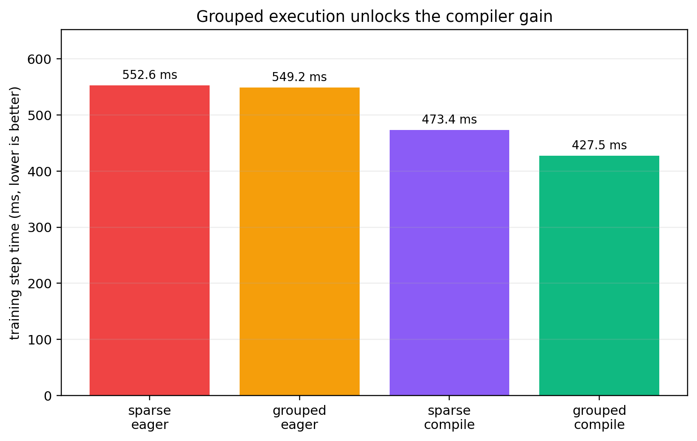

> **图注｜grouped 与 compile 交互证据。** 柱状对比显示 grouped 在 eager 下收益很小，但在 compile 下可进一步降低步时，证明两者存在协同作用。（小白版：先把杂乱工作整理整齐，再让编译器批量处理，两个办法一起用才真正明显变快。）

### 4.5.2.2　SDPA：不改变权重，消除注意力中间矩阵

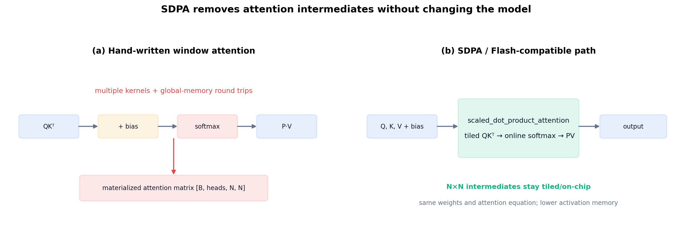

> **图注｜SDPA 原理图。** SDPA 将 `QKᵀ→softmax→PV` 分块融合，避免完整注意力矩阵反复写回显存，同时保持注意力公式不变。（小白版：答案算法没换，只是不再把一张很大的中间草稿完整保存下来，所以更省显存。）

手写窗口注意力依次执行 `QKᵀ`、相对位置偏置、softmax 和 `P·V`，并显式保存 `[B, heads, N, N]` 中间矩阵。`scaled_dot_product_attention` 将该过程交给 PyTorch 后端，使用分块/融合内核时可避免将完整注意力矩阵往返全局显存；模型权重和注意力方程保持不变。

**表 4-17　SDPA 与 compile/grouped 的组合结果（bs=10）**

| 配置 | ms/step | 峰值显存 | 相对 sparse-eager |
|---|---:|---:|---:|
| sparse + vanilla + eager | 552.63 | 70.83 GB | 1.000× |
| sparse + vanilla + compile | 473.40 | 68.80 GB | 1.167× |
| sparse + SDPA + compile | 474.05 | **61.32 GB** | 1.166× |
| grouped + vanilla + eager | 549.21 | 77.04 GB | 1.006× |
| grouped + vanilla + compile | 427.47 | 77.03 GB | 1.293× |
| grouped + SDPA + compile | **427.11** | **69.51 GB** | **1.294×** |

> **表注｜表 4-17。** 该组合实验同时报告步时与峰值显存，用来判断 SDPA、grouped 和 compile 分别改善速度还是显存。（小白版：SDPA 在这里主要负责“省空间”，grouped+compile 主要负责“跑得快”，三者可以各司其职。）

**结果分析。** SDPA 在当前小窗口上主要贡献显存而非额外速度：sparse compile 显存减少约 7.5 GB，grouped compile 也减少约 7.5 GB，单步时间基本不变。该显存恰好抵消 grouped 固定容量缓冲的大部分成本，使“规则专家 GEMM”和“较低注意力激活”可以同时采用。同权重对拍的最大绝对误差为 1.7e-5，满足数值一致性要求。

### 4.5.2.3　分组容量 MoE：改变执行形状，不改变 top-k 规则

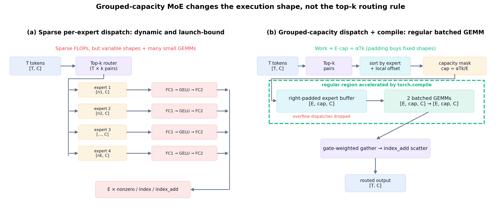

> **图注｜分组容量 MoE 原理图。** 左侧 sparse 路径按专家执行不同形状的小 GEMM；右侧 grouped 路径保留同一 top-k 路由，但将 token 填入固定容量缓冲后执行两次规则 batched GEMM。（小白版：专家选择没有变，只是先把送给各专家的任务装进同样大小的格子，再一次性批量计算。）

设 token 数为 T、top-k 为 k、专家数为 E。分组路径先将 `D=T·k` 个 dispatch 按专家排序，用每个专家的起始偏移得到桶内位置，再按

\[
\mathrm{cap}=\left\lfloor \alpha\frac{Tk}{E}\right\rfloor
\]

构造 `[E, cap, C]` 右填充缓冲。所有专家的 FC1/FC2 因而收敛为两次批量 GEMM，最后按 gate 权重散回 token。超过容量的 dispatch 被丢弃；α 控制速度、显存和质量之间的权衡。

**表 4-18　分组前后的算子结构**

| 算子 | sparse：调用数 / CUDA | grouped：调用数 / CUDA | 变化 |
|---|---:|---:|---:|
| `aten::linear` | 1504 / 236.30 ms | 352 / 98.52 ms | 调用数 -76.6% |
| `aten::mm` | 3168 / 449.07 ms | 864 / 197.55 ms | 调用数 -72.7% |
| `AddmmBackward0` | 1344 / 435.38 ms | 192 / 183.88 ms | 调用数 -85.7% |
| `IndexBackward0` | 1200 / 100.06 ms | Top-20 中消失 | 动态索引反向退出主路径 |
| `aten::bmm` | 488 / 231.81 ms | 776 / 746.32 ms | 规则批量 GEMM成为主算子 |

> **表注｜表 4-18。** 表中对比改造前后的算子调用结构，验证大量逐专家 linear、mm 和索引反向已被规则 bmm 取代。（小白版：零碎的小任务确实被合并成了大批量任务，但填充出来的空位也会增加计算，所以还需要 compile 才能兑现速度收益。）

**结果分析。** grouped 确实将大量小 linear/mm 和索引反向收敛为 bmm；但 padding 使 bmm 总时长上升，所以 eager 总时间没有明显改善。该表与表 4-16 共同说明：结构改造和 compile 是不可拆分的联合创新。`copy_` 仍为 3324 次/136.79 ms，表明后续优化空间主要在 gather/scatter 融合。

**表 4-19　专家数 E 对 grouped 收益的影响（SDPA+compile）**

| E | sparse ms | grouped ms | grouped 单步降幅 |
|---:|---:|---:|---:|
| 4 | 405.76 | 511.47 | -26.1% |
| 8 | 437.64 | 436.78 | +0.2% |
| 12 | 470.78 | 427.35 | +9.2% |
| 16 | 505.50 | 428.63 | +15.2% |
| 24 | 595.99 | 426.86 | +28.4% |
| 32 | 683.39 | 435.80 | **+36.2%** |

> **表注｜表 4-19。** 该扫描固定其余配置，仅改变专家数 E，用于观察 grouped 相对 sparse 的收益随模型结构如何变化。（小白版：专家很少时打包反而不划算；专家越多，逐个处理越慢，批量处理的优势就越明显。）

**结果分析。** sparse 的逐专家循环随 E 增长，grouped 始终保持两次专家批量 GEMM；交叉点约为 E=8。当前 E=12 已有 9.2% 单步降幅，E=32 达 36.2%，证明该方案针对的是“多专家、小专家”的可扩展瓶颈，而非偶然优化一个固定配置。

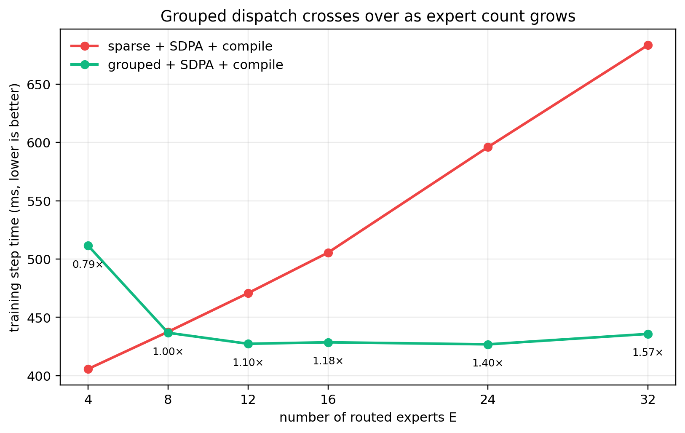

> **图注｜专家数扩展曲线。** 曲线展示 sparse 步时随专家数明显增长，而 grouped 基本保持稳定，并在约 E=8 后开始占优。（小白版：逐个叫专家干活时，专家越多等待越久；批量安排后，增加专家带来的额外开销小得多。）

### 4.5.2.4　容量—吞吐—质量的 Pareto 选择

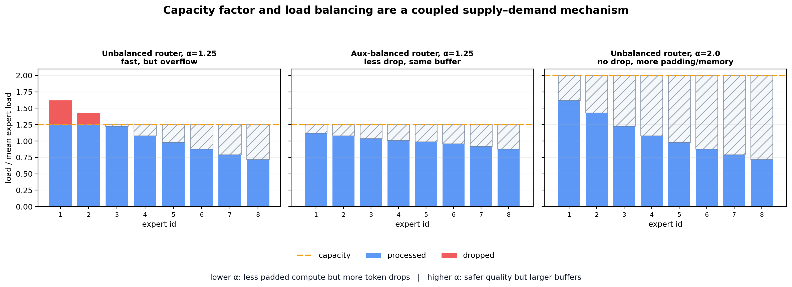

> **图注｜容量与负载均衡原理。** 蓝色表示实际处理负载，红色表示超过容量而丢弃的 dispatch，斜线区域表示预留但未使用的容量；负载均衡与 α 共同决定丢弃和填充。（小白版：盒子太小会装不下并丢任务，盒子太大又会浪费空间；把任务分均匀可以用较小盒子装下更多任务。）

**表 4-20　预训练权重下的容量性能与冻结质量探针**

| 配置 | bs=10 samples/s | 峰值显存 | dispatch 丢弃 | 输出 MAE vs sparse | ΔMI | ΔVIF |
|---|---:|---:|---:|---:|---:|---:|
| sparse | 21.095 | 61.32 GB | 0 | 0 | 0 | 0 |
| α=1.00 | **25.435** | 62.75 GB | 6.748% | 2.63e-4 | -2.92e-2 | -1.40e-3 |
| α=1.25 | 23.413 | 69.51 GB | 0.800% | 3.67e-5 | -5.71e-3 | -2.48e-4 |
| α=1.50 | 21.669 | 76.20 GB | 0.121% | 3.13e-6 | -8.67e-4 | -3.20e-5 |
| α=2.00 | bs=10 OOM | — | 0.0039% | 7.82e-8 | +1.07e-5 | +6.64e-8 |
| α=4.00 | bs=10 OOM | — | 0 | 0 | 0 | 0 |

> **表注｜表 4-20。** 表中联合比较容量因子 α 对吞吐、显存、dispatch 丢弃和冻结质量指标的影响，用于寻找可用折中点。（小白版：α 越小通常越快省空间，但更容易漏掉任务；α 越大更完整，却可能因占用显存太多而跑不起来。）

**结果分析。** α=1.0 吞吐提高 20.6%，但 6.75% 丢弃已造成可见 MI/VIF 下降；α=1.25 吞吐提高 11.0%，总体丢弃降至 0.80%，五项融合指标变化很小，是速度档；α=1.5 基本贴近 sparse，但吞吐收益只剩 2.7%，是保守档；α≥2 数值等价却无法维持 bs=10。质量实验覆盖三任务各 15 个真实样本，只能证明冻结模型的即时扰动很小，不能代替不同 α 独立训练后的最终质量统计。

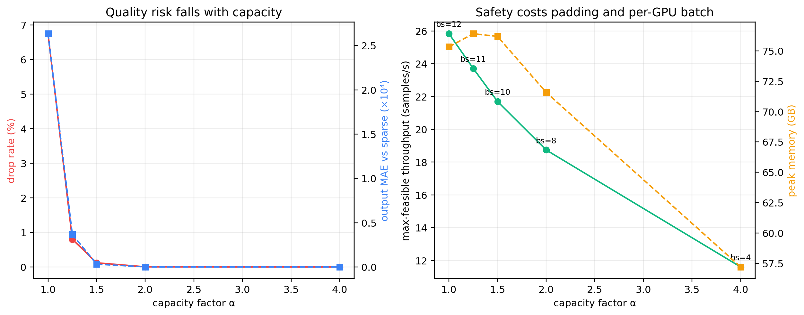

> **图注｜容量 Pareto 曲线。** 图中同时呈现吞吐收益、丢弃率、质量扰动和显存约束，α=1.25 位于速度与风险较均衡的折中区域。（小白版：这张图不是找每项都第一的方案，而是找“跑得够快、丢得够少、显存也放得下”的中间选择。）

在最大可运行 batch 下，sparse 的已验证最大吞吐为 22.20 samples/s（bs=13），α=1.0 为 25.83（bs=12，+16.4%），α=1.25 为 23.71（bs=11，+6.8%）；α≥1.5 因容量缓冲挤占 batch 空间而不再具备系统吞吐优势。故本文将 α=1.25 作为性能配置、α=1.5 作为质量保守配置，并保留 sparse 零丢弃回退。

## 4.5.3　分布式优化：从“通信猜测”转向临界路径证据

### 4.5.3.1　为何当前选择 DDP 而不是 FSDP/EP

4.11 M FP32 参数、梯度及 Adam 两个状态合计不足 0.1 GB，而训练峰值为 61–76 GB，显存显然由激活、损失分支和容量缓冲主导。FSDP/ZeRO 切分不到 0.2% 的峰值，却需要额外 reduce-scatter/all-gather；Expert Parallel 则会将当前本地专家 bmm 改成 token all-to-all。因此当前最优并行维度是纯数据并行，分布式优化应集中在梯度缓冲、分桶重叠和 rank 负载均衡。

**表 4-21　开源框架机制与当前模型的匹配**

| 机制 | 解决对象 | 本模型结论 |
|---|---|---|
| PyTorch DDP 分桶、bucket view、static graph | 梯度归约与图搜索 | **采用** |
| Megatron overlap-grad-reduce | 通信与反向重叠 | DDP reducer 已提供同类能力 |
| Megatron distributed optimizer / param gather | 大参数状态切分 | 参数太小，暂不采用 |
| DeepSpeed ZeRO/FSDP | 参数/梯度/优化器显存 | 激活才是瓶颈，暂不采用 |
| Expert Parallel A2A | 单卡放不下的大量专家 | 12 个小专家可本地容纳，暂不采用 |
| 固定 shape + 任务/成本均衡分片 | rank straggler | **采用为数据侧原则** |

> **表注｜表 4-21。** 该表按“机制解决的问题是否与当前实测瓶颈一致”筛选分布式方案，而不是按框架规模机械套用。（小白版：工具要对症下药；本模型不是参数放不下，所以没必要先使用专门切大模型参数的复杂方案。）

**结果分析。** 本文吸收大规模框架的“连续缓冲、异步分桶、静态图”思想，但不机械照搬模型状态切分和专家并行。优化并行维度必须由参数、激活和通信的实测比例决定。

### 4.5.3.2　NCCL 链路与模型大小感知分桶

4/8 卡 all-reduce 微基准显示，16 KiB–1 MiB 消息主要受约 40 μs 固定启动延迟控制；4/8/16 MiB 时 4 卡总线带宽分别达到 104.85/161.94/217.62 GB/s。当前全部梯度只有约 15.67 MiB，一次归约约百微秒，远小于约 422 ms 的计算步。

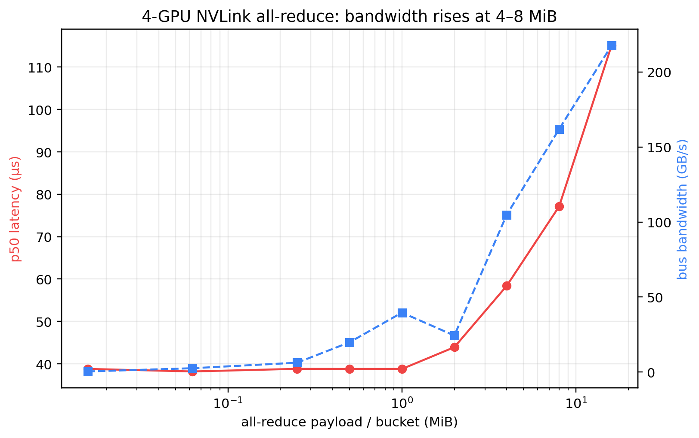

> **图注｜NCCL 桶曲线。** 曲线区分小消息的固定启动延迟区与大消息的带宽利用区，为选择 DDP bucket 大小提供链路基线。（小白版：每次通信都有固定“起步费”；包太小会反复交起步费，包够大后才能真正利用高速链路。）

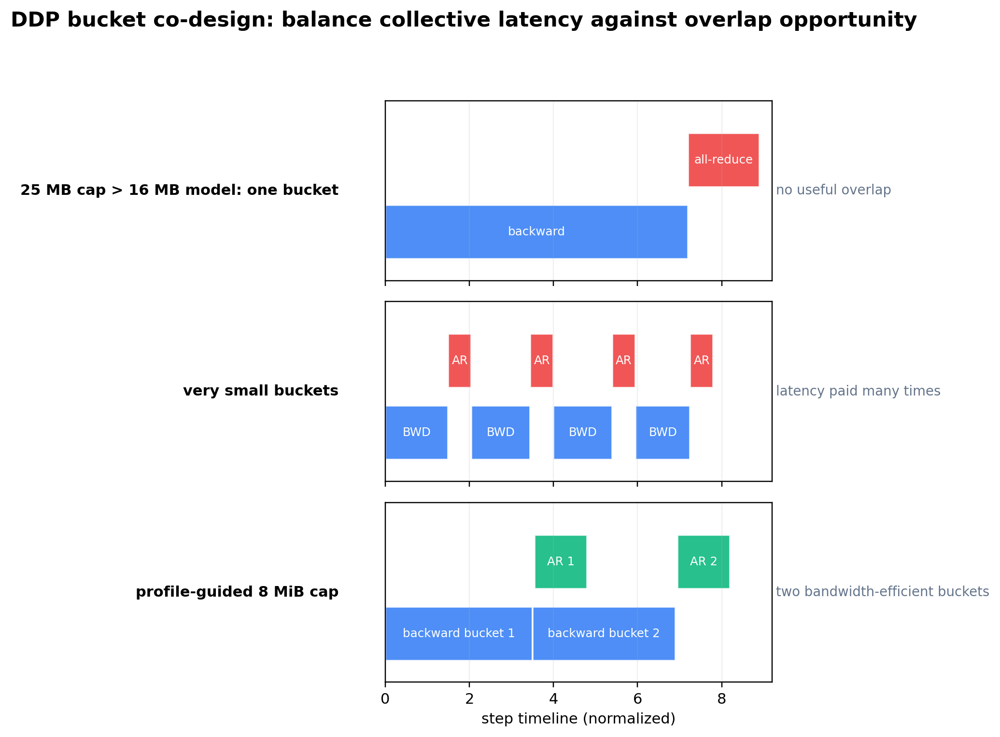

> **图注｜DDP 分桶与重叠原理。** 单大桶难以提前归约，过多小桶反复支付启动延迟，适中的两桶可在反向计算期间启动通信并减少暴露时间。（小白版：一大包要等全部算完才寄出，很多小包又要频繁付快递起步费；分成两包更容易边算边寄。）

**表 4-22　DDP-4 梯度分桶扫描**

| bucket cap | 重建桶数 | ms/step | global samples/s |
|---:|---:|---:|---:|
| 1 MiB | 15 | 427.75 | 93.512 |
| 2 MiB | 8 | 426.36 | 93.817 |
| 4 MiB | 4 | 426.23 | 93.847 |
| 8 MiB | 2 | **425.57** | **93.993** |
| 25 MiB | 1 | 426.78 | 93.726 |

> **表注｜表 4-22。** 扫描结果显示 8 MiB 重建为两个桶时步时最低，但各配置差距很小，说明分桶是细粒度优化而非主要瓶颈修复。（小白版：两包方案在这次测试里最好，但只快一点点，说明通信本来就不是最拖后腿的部分。）

**结果分析。** 1 MiB 重复支付 15 次 collective 启动延迟；25 MiB 大于全部梯度，只形成一个桶，不能在反向中提前启动；8 MiB 重建为约 8.09/7.58 MiB 两个高带宽桶，在启动次数和重叠机会之间最优。最终 static-graph 配置中，8 MiB 相比 25 MiB 也将 423.20 ms 降到 422.32 ms，方向一致。0.5 MiB 因小于 PyTorch 1 MiB 首桶约束而不支持。

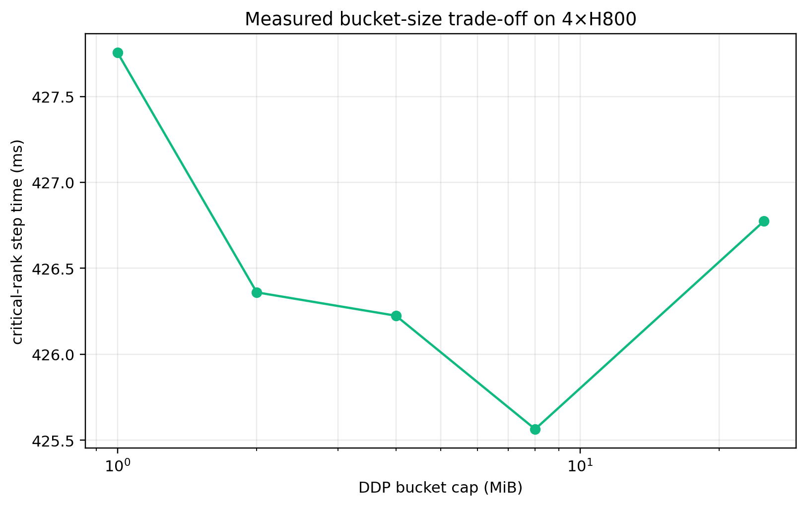

> **图注｜DDP 分桶实测。** 图中将不同 bucket cap 的实际步时和吞吐可视化，最低点对应 8 MiB 的两桶配置。（小白版：横向比较几种打包大小后，8 MiB 略优，但没有出现某个方案快很多的情况。）

### 4.5.3.3　连续梯度、fused Adam 与静态图

**表 4-23　DDP-4 逐项消融**

| 配置 | ms/step | global samples/s | 相对上一项 |
|---|---:|---:|---:|
| baseline：25 MiB、find-unused | 439.63 | 90.986 | — |
| + `gradient_as_bucket_view` | 437.70 | 91.388 | +0.44% |
| + fused Adam | 424.99 | 94.120 | +2.99% |
| + static graph、关闭 unused 搜索 | 423.56 | 94.437 | +0.34% |
| + 8 MiB 两桶 | **422.32** | **94.716** | +0.30% |

> **表注｜表 4-23。** 逐项消融保持前序优化不变，再依次增加 bucket view、fused Adam、static graph 和 8 MiB 分桶，以估计每项增量贡献。（小白版：一次只加一个改动，才能看清真正的大头是 fused Adam，而不是把所有提升都算给通信。）

**结果分析。** 累计吞吐提升 4.10%，最大贡献来自 fused Adam，说明大量小参数的 optimizer launch 比 NCCL 更值得优化。bucket view 避免梯度到通信桶的拷贝；DDP 日志只发现 768 B unused 参数，且使用集合固定，因此可以安全启用 static graph。旧的单次对照已提示通信差异很小，下节进一步用独立重复、桶级时间戳、batch 边界和通信压力四组证据检验该结论。

### 4.5.3.4　证明当前瓶颈不在 NCCL

**表 4-24　真实梯度通信的独立重复（均值±独立试验标准差；每次 80 步）**

| GPU 数 | noop ms/step | DDP default ms/step | 同步 all-reduce ms/step | default−noop | 差值 95% CI |
|---:|---:|---:|---:|---:|---:|
| 4 | 422.80±1.25 | 422.66±0.66 | 423.22±0.86 | -0.13 ms（-0.03%） | [-3.98, 3.71] ms |
| 8 | 430.93±0.26 | 429.84±2.87 | 431.43±0.12 | -1.09 ms（-0.25%） | [-7.79, 5.60] ms |

> **表注｜表 4-24。** noop、默认异步 DDP 和同步归约采用独立重复比较；default−noop 的 95% 置信区间跨 0，不能确认默认通信带来可辨认步时损失。（小白版：几毫秒差异小于多次运行自身的波动，所以不能因为某次数字更大或更小就断言通信拖慢了训练。）

**结果分析。** 两种卡数下 default−noop 的均值为负且 95% 区间都跨 0，不能把均值差解释成“负通信开销”，只能说明真实 DDP 暴露成本小于当前运行漂移。同步归约也没有造成数量级变化。带 Python Future 回调和 CUDA Event 的 timed hook 比 default 多出调度开销，故只用于定位桶时间线，不参与最终吞吐比较。

**表 4-25　异步通信桶 CUDA Event 时间线（3 次试验；先按试验聚合 rank）**

| GPU 数 | 梯度字节/桶数 | 首桶 ready | 末桶 ready | 通信完成上界 | 末桶暴露上界 | step 结束 |
|---:|---:|---:|---:|---:|---:|---:|
| 4 | 16.43 MB / 2 | 387.35 ms | 423.67 ms | 424.58 ms | **0.91 ms** | 425.34 ms |
| 8 | 16.43 MB / 2 | 388.11 ms | 425.34 ms | 431.75 ms | **6.41 ms** | 432.47 ms |

> **表注｜表 4-25。** CUDA Event 记录梯度桶就绪到 NCCL 完成的 GPU 时间线；“末桶暴露上界”还包含回调调度，因此只作为保守上界。（小白版：第一桶可以趁后面还在计算时偷偷传输，真正可能让大家停下来等的主要是最后一桶，而且表里的等待值宁可算大、不算小。）

原先直接在 Future 回调中读取主机时钟只能得到“回调提交时刻”，不能证明 GPU collective 已完成；表中已改为在 step 起点、bucket ready、回调流等待 NCCL 后和 step 末尾分别记录 CUDA Event。首桶可与后续约 36–37 ms 的反向计算重叠。末桶上界为 4 卡 0.91 ms、8 卡 6.41 ms；8 卡约占 timed 步时 1.48%。该值仍包含 Future 回调调度，是纯 NCCL 时间的保守上界；是否真正暴露到默认临界路径，应以表 4-24 中跨 0 的 default−noop 区间判断。

**表 4-26　固定 16.43 MB 梯度下的 batch 边界**

| 每卡 batch | noop ms | default ms | default−noop |
|---:|---:|---:|---:|
| 1 | 85.91 | 86.85 | +0.94 ms（1.09%） |
| 2 | 120.78 | 120.32 | -0.46 ms |
| 5 | 239.60 | 238.45 | -1.14 ms |
| 10 | 423.36 | 422.71 | -0.65 ms |

> **表注｜表 4-26。** 梯度通信量保持 16.43 MB 不变，仅增大每卡 batch 来提高计算量，用于寻找通信由显著到可隐藏的边界。（小白版：传输的东西一样多，但每步计算越来越多；连 batch=1 时通信差也只有约 1%，说明正常 batch=10 更不容易被通信卡住。）

梯度量不随 batch 改变，而计算量随 batch 增长。即使在最不利的 batch=1，通信差也只有约 1.1%；batch≥2 后符号随噪声改变。当前 batch=10 明显处在计算主导区，而不是通信—计算交界点。

**表 4-27　纯串行 all-reduce 的反事实通信压力**

| 压力方式 | 额外串行字节 | 4 卡步时增量 | 8 卡步时增量 |
|---|---:|---:|---:|
| 单轮 payload=16 MiB | 16 MiB | -0.17 ms | +1.71 ms |
| 单轮 payload=64 MiB | 64 MiB | +0.10 ms | +2.39 ms |
| 单轮 payload=256 MiB | 256 MiB | +0.73 ms | +3.24 ms |
| 16 MiB × 4 轮 | 64 MiB | -1.69 ms | +1.81 ms |
| 16 MiB × 16 轮 | 256 MiB | -0.36 ms | +3.96 ms |
| 16 MiB × 64 轮 | 1 GiB | +4.36 ms | +8.04 ms |

> **表注｜表 4-27。** 该反事实实验在人为串行、不可重叠的位置注入额外 all-reduce，用来验证步时是否能对足够大的通信压力作出响应。（小白版：故意往训练里塞越来越多必须等待的通信；只有塞到很大时才明显变慢，说明正常训练的通信量还没到危险程度。）

注入缓冲区为全零，不再混入逐元素除法；每轮使用同步 collective，不能与计算重叠。8 卡单轮 payload 曲线随 16→64→256 MiB 单调增加，4 卡的小压力点仍被运行漂移覆盖，直到 1 GiB 才明显抬升。该实验不是带宽估计，而是反事实敏感性测试：系统能够检测到人为制造的通信压力，但当前两个异步桶远未成为主导项。

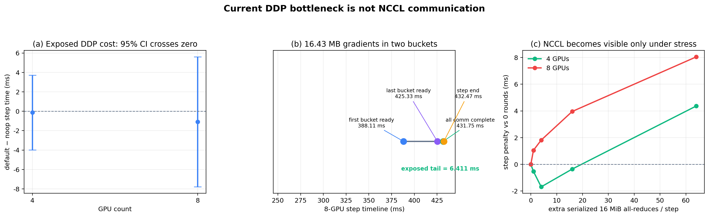

> **图注｜通信瓶颈三层证据。** 三个子图依次汇总默认/去通信对照、桶级 CUDA Event 时间线和人工通信压力曲线，从不同角度检验 NCCL 是否位于临界路径。（小白版：先把通信拿掉看会不会变快，再量通信实际何时结束，最后故意加重通信看系统是否敏感；三步都指向“当前通信不是主因”。）

`torch.compile(DDP(model))` 的 DDPOptimizer 顺序也做了复核：8 卡均值为 430.51 ms，原先 `DDP(torch.compile(model))` 为 430.82 ms，差异仍在噪声内；当前只有两个桶，没有额外的图切分收益。故不把改变 compile/DDP 顺序列为有效优化。

### 4.5.3.5　卡数扩展与物理慢卡

**表 4-28　1/2/4/8 卡扩展（每卡 batch=10）**

| GPU 数 | ms/step | global samples/s | 扩展效率 |
|---:|---:|---:|---:|
| 1 | 421.37 | 23.732 | 100.00% |
| 2 | 422.63 | 47.323 | 99.70% |
| 4 | 423.20 | 94.519 | 99.56% |
| 8 | 425.22 | 188.138 | **99.08%** |

> **表注｜表 4-28。** 在每卡 batch 固定为 10 时，卡数从 1 增至 8，吞吐达到单卡的 7.93 倍，扩展效率保持 99.08%。（小白版：理想情况下 8 张卡应快 8 倍，实际快 7.93 倍，已经非常接近理想扩展。）

8 卡达到单卡吞吐的 7.93×。但桶级时间戳发现，正常映射下 rank7 的首梯度连续三次比其他 rank 晚约 4–5 ms。反转 `CUDA_VISIBLE_DEVICES` 后，慢点从 rank7 移到 rank0，仍对应**物理 GPU7**；NUMA 本地 CPU 绑核后也仍跟随物理 GPU7，排除了 rank 编号和 CPU 亲和性的解释。

**表 4-29　逐卡同负载基准**

| 物理 GPU | 0 | 1 | 2 | 3 | 4 | 5 | 6 | 7 |
|---:|---:|---:|---:|---:|---:|---:|---:|---:|
| ms/step | 419.54 | 419.48 | 419.56 | 419.65 | 419.87 | 420.18 | 419.50 | **421.50** |

> **表注｜表 4-29。** 八张物理卡分别运行完全相同的单卡负载，GPU7 的平均步时最高，用于区分物理卡差异与 rank 编号差异。（小白版：让每张卡单独做同一份作业后，第 7 号实体卡仍稍慢，所以问题跟这张卡本身的运行状态走。）

GPU7 比其余七卡均值慢 1.82 ms（0.43%），其三次内部重复还出现 419.86→421.11→423.54 ms 的漂移。所有卡的最大 SM 时钟和功率上限相同，因此现有证据只能将其归类为物理卡运行态/热稳态差异，不能归因于 NCCL。调度器应记录“物理卡—首梯度 ready”而不是只记录 local rank。

**表 4-30　单 GPU 计算停顿的临界路径传播**

| rank0 注入 GPU 停顿 | DDP-4 ms/step | 相对基线 |
|---:|---:|---:|
| 0 ms | 422.81 | 0 |
| 2 ms | 425.27 | +2.46 ms |
| 5 ms | 428.19 | +5.38 ms |
| 10 ms | 432.84 | +10.04 ms |

> **表注｜表 4-30。** 只在 rank0 注入已知 GPU 停顿，观察全局步时几乎按 1:1 增长，用于验证慢 rank 会进入 DDP 临界路径。（小白版：一张卡故意晚 10 ms，所有卡完成一轮也几乎晚 10 ms，因为集体同步必须等最慢的那张卡。）

CPU 输入停顿和 GPU 计算停顿都近似 1:1 进入全局步时。同步后的 rank 结束时间差仍接近 0，说明只看 step 尾部 CV 会把“大家一起等慢卡”误判成负载均衡；首梯度 ready 才能暴露真正的上游差异。

### 4.5.3.6　任务均衡对照：标签均衡不等于成本优化

真实 DataLoader 实验暴露了比 NCCL 更大的 worker 拓扑敏感性。三任务实际样本数并不相同，而是 3894/3249/3468。默认 `DistributedSampler` 的前 500 个样本在四个 rank 上分别为 `[186,172,142]`、`[187,157,156]`、`[189,157,154]`、`[171,163,166]`。预取使显式 `next()` 等待很小，但 4 workers/rank 的临界步稳定在约 496 ms。

初版“各任务截到最小长度再等量切分”的原型会改变样本集合和任务先验，所得 14.69% 提升不能归因于负载均衡，故予以废弃。修正版先生成与 `DistributedSampler` 相同的全局随机序列，再在每个 40 样本全局 batch 内重新分配到 4 个 rank；逐步断言两种策略使用完全相同的全局样本集合和任务计数。修正版将三任务的 rank 间计数跨度从 18/15/24 降至 4/4/5，但不截断较大任务。

**表 4-31　真实数据输入侧优化（DDP-4，三次独立试验）**

| 方案 | 临界步 ms | 相对默认 4 workers |
|---|---:|---:|
| 1 worker/rank | 424.44±2.35 | 步时 -14.50% |
| 4 workers/rank，默认 sampler（受控复测） | 496.43±1.51 | 基线 |
| 4 workers/rank + 主线程/worker 隔核 | 490.57±0.18 | 步时 -1.18% |
| 4 workers/rank + **同样本任务均衡** | 496.84±0.71 | 步时 **+0.08%** |
| 8 workers/rank | 424.38±0.87 | 步时 -14.51% |

> **表注｜表 4-31。** 所有 sampler 对照保持同一全局样本集合；结果显示任务标签均衡没有收益，而 DataLoader worker 数和进程隔离方式对步时更敏感。（小白版：把三类样本分得更平均并没有变快，真正影响速度的是“每张卡安排多少个取数据工人、这些工人如何抢 CPU”。）

三次配对的“任务均衡−默认”差值为 +0.41 ms，95% CI 为 [-1.85, 2.68] ms，没有可辨认收益。反转 GPU 映射后慢点仍留在 rank0，但受控任务均衡也不能消除它，说明根因不是任务标签计数，而更可能是 worker 数、预取和进程竞争的非单调交互；1 或 8 workers/rank 均较快，4 workers/rank 反而最慢。任务均衡原型因此不应并入正式训练。

控制实验进一步将每步 20 ms 的相同总输入成本分别集中到一个 rank 或均匀分到四个 rank：偏斜布局为 441.75 ms，均衡布局为 428.21 ms，回收 13.54 ms，即消除了 73.9% 的人为偏斜损失。这说明**成本异构存在时**均衡机制有效，但当前固定形状数据不能用任务标签预测该成本。后续只有在观测到 `分辨率/解码类型/历史 EMA 耗时` 与慢 rank 的稳定相关性后，才值得实验成本感知分配。

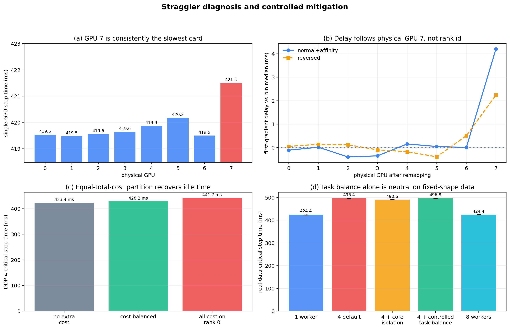

> **图注｜straggler 诊断与治理。** (a)(b) 证明慢点跟随物理 GPU7，(c) 证明真实成本偏斜可通过均衡分配回收等待，(d) 证明当前固定形状数据仅均衡任务标签无效。（小白版：先找到“谁慢”，再确认慢的是实体卡而不是编号；只有任务真的耗时不同时重新分工才有用，单纯把类别数量分平均没用。）

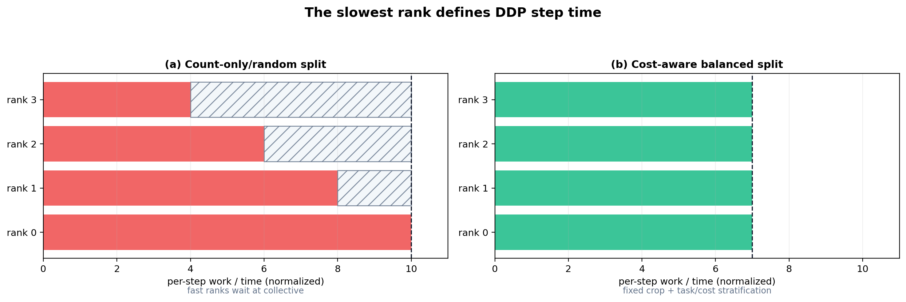

> **图注｜rank 负载均衡原理。** DDP 每步完成时间由最慢 rank 决定；应依据可预测成本或历史耗时均衡工作，而不能只看同步结束时各 rank 是否同时到达。（小白版：小组作业必须等最后一个人交卷，大家最后同时离场不代表大家做得一样快；要在开工前按真实工作量合理分配。）

路由负载本身并未形成同量级慢 rank。balanced/homogeneous 任务布局下，grouped 分别为 424.97/424.27 ms，sparse 为 469.53/470.30 ms；路由 load CV 从 0.136 到 0.171 变化时，grouped 主 GEMM 仍保持 `[E, cap, C]` 固定形状。固定容量因此既利于 compile，也将路由不均与主计算量解耦；当前真正需要治理的是物理卡和 DataLoader worker 拓扑，而不是专家 all-to-all 或任务标签计数。

## 4.5.4　本节小结

本节得到五点结论：

1. **profile 决定优化对象。** 当前热点是小 GEMM、动态索引和 launch，而非参数规模；
2. **三项单卡创新分工明确。** compile 消 launch，SDPA 省注意力中间激活，grouped 将专家执行改造成规则批量 GEMM；grouped 与 compile 联合达到 1.294×，而非各自收益的简单相加；
3. **grouped 的价值随专家数增长。** E=12 已降低 9.2% 单步，E=32 降低 36.2%，但 E=4 会变慢；
4. **容量必须与质量和显存共同选择。** α=1.25 是速度档，α=1.5 是保守档，sparse 是零丢弃回退；冻结探针不能替代重新训练；
5. **当前分布式不是通信受限。** 两个真实梯度桶的 CUDA Event 完成上界为 4 卡 0.91 ms、8 卡 6.41 ms，default−noop 置信区间仍跨 0，DDP 1→8 卡效率为 99.08%；真正需要防范的是物理慢卡和 DataLoader worker 拓扑。系统配置推荐 `grouped α=1.25 + SDPA + compile + gradient_as_bucket_view + fused Adam + static_graph + 8 MiB bucket`；任务标签均衡没有收益，暂不进入正式训练。

局限包括：质量仅做 45 样本冻结探针；多卡实验仅覆盖单机高速互连，不能外推跨节点；CUDA Event 完成时刻仍包含 Future 回调调度，本文将其作为上界，并不报告不可靠的通信隐藏比例；任务均衡结论来自 50 步性能探针，未做完整 epoch 收敛验证；gather/scatter 的 `copy_` 尚未被融合，是下一步自定义 Triton kernel 的候选方向。
