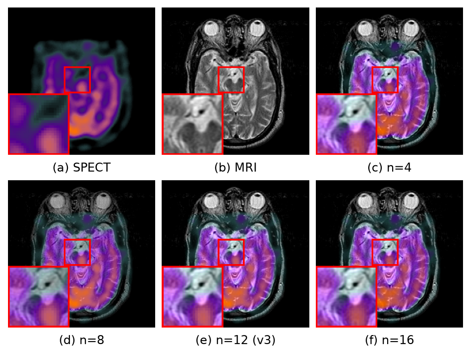
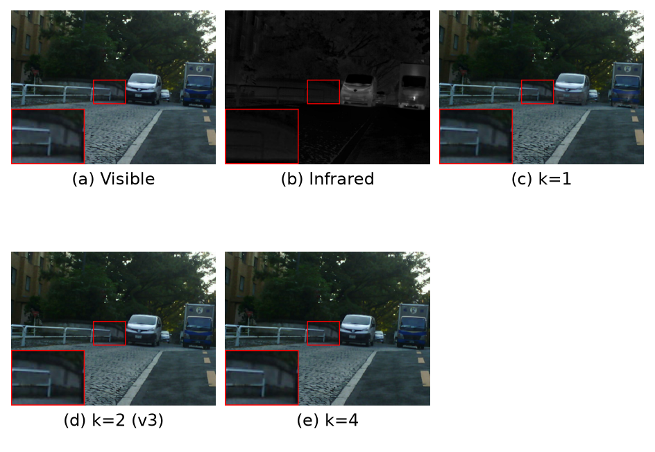
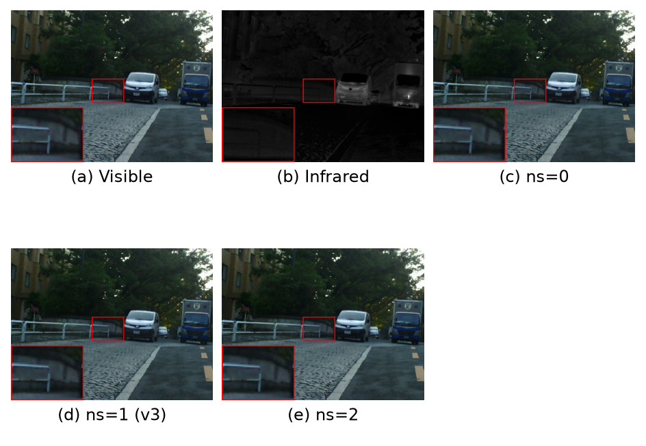
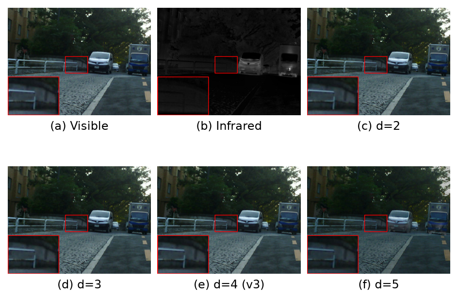
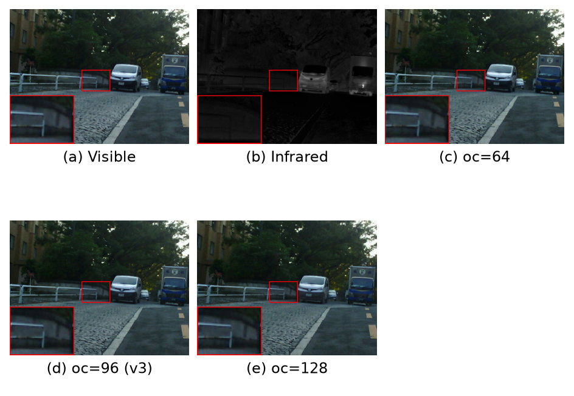
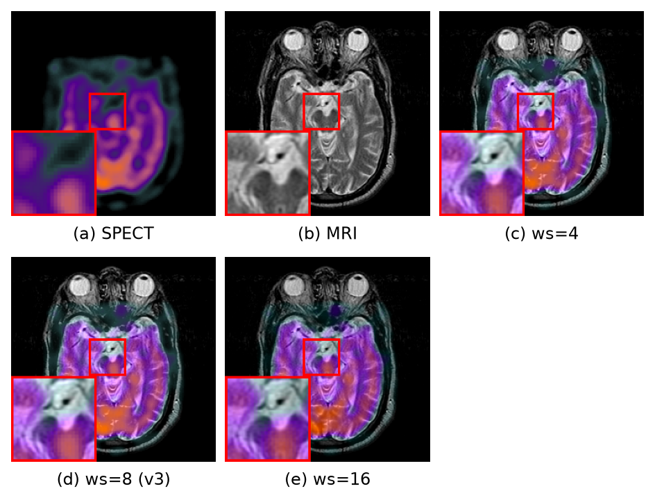
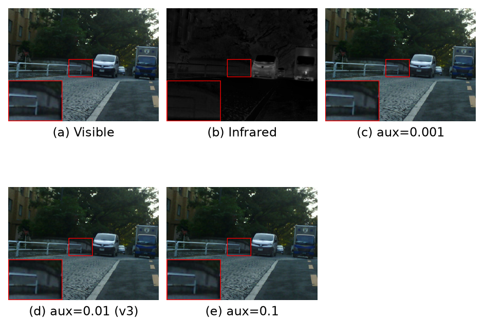
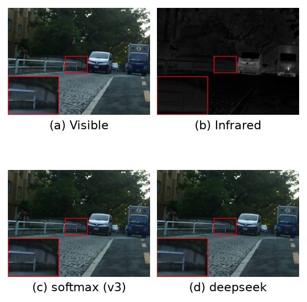

# 4.4　超参数分析

§4.3 的消融回答的是「某个**创新点**是否有用」（去掉整个模块看退化）；本节回答的是「同一创新点内部，某个**超参数**取什么值最好」（固定结构、只改一个取值看优劣）。二者对象不同、不混：本节所列的窗口大小 ws、骨干深度 depth、路由专家数 n_routed 等，均为在**保留全部创新点**前提下的取值扫描。

本文共扫描 8 个超参数，取值与 v3 选定值如表 4-13 所示（加粗为 v3 采用值）。除被测项外，其余超参与 v3 完全一致，每个取值重新训练 20 epoch，再在三个模态测试集上评测。个别显存超限项（k=4、out_channel=128、n_shared=2 用 batch=6，window_size=16 用 batch=2）已注明，不影响判优结论。

**表 4-13　可调超参数与扫描取值**

| 编号 | 超参数 | 含义 | 扫描取值（**加粗**=v3） |
|---|---|---|---|
| P1 | n_routed | 路由专家数 | 4 / 8 / **12** / 16 |
| P2 | top-k | 每 token 激活专家数 | 1 / **2** / 4 |
| P3 | n_shared | 常开共享专家数 | 0 / **1** / 2 |
| P4 | depth | 骨干 Transformer 深度 | 2 / 3 / **4** / 5 |
| P5 | out_channel | 特征通道数 | 64 / **96** / 128 |
| P6 | window_size | 窗口注意力窗口边长 | 4 / **8** / 16 |
| P7 | aux_weight | 负载均衡辅助损失权重 | 0.001 / **0.01** / 0.1 |
| P8 | routing | 路由方式 | **softmax+aux** / deepseek 无辅助损失 |

## 4.4.1　判优口径

与 §4.2 的 SOTA 横向对比不同，超参数判优**不能只看单指标数值的高低**：融合任务里 SSIM、CC、Nabf 等平滑类指标在「更模糊、更保守」的配置下反而虚高，若以此判优会得出「越糊越好」的错误结论。因此本节沿用内部统一口径——**优势指标保持度**：v3 的取胜点在于它相对 18 个 SOTA 方法**排进 Top-3 的那 14 个优势指标**（irvis 4 个、medical 5 个、gfp 5 个，其中 MI、VIF 为全场第一的锚点）。某个取值好不好，就看它能保住多少个这样的优势指标仍在 Top-3 band 内（满分 14，越高越好）。

八个超参数全部取值的优势指标保持度总览如表 4-14 所示。**每一个参数都在 v3 采用值上取得唯一或并列最高（=14），任何偏离都会掉点**，这构成本节的核心结论；下面 4.4.2 逐参数给出三模态完整指标表与定性图佐证。

**表 4-14　各超参取值的优势指标保持度（满分 14，越高越好；加粗=v3 值）**

| 超参数 | 取值与保持度 | 最优 |
|---|---|---|
| n_routed | 4→12 · 8→10 · **12→14** · 16→11 | **12** |
| top-k | 1→10 · **2→14** · 4→11 | **2** |
| n_shared | 0→11 · **1→14** · 2→12 | **1** |
| depth | 2→11 · 3→12 · **4→14** · 5→9 | **4** |
| out_channel | 64→14 · **96→14** · 128→11 | 64、**96** |
| window_size | 4→11 · **8→14** · 16→12 | **8** |
| aux_weight | 0.001→14 · **0.01→14** · 0.1→10 | 0.001、**0.01** |
| routing | **softmax+aux→14** · deepseek→12 | **softmax+aux** |

## 4.4.2　逐参数分析（客观 + 主观）

每个参数给出三个模态（IR-VIS / 医学 / 显微 GFP–PC）各一张 5 指标表（↑ 越大越好，Nabf ↓ 越小越好；**加粗行**=v3 采用值），随后一张定性图（选该参数效果最直观的模态，红框 + 左下角局部放大；v3 值面板标注 (v3)）。读表原则同 §4.3：不看单指标虚高，看优势指标保持度与三任务均衡。完整 12 指标见内部记录 `../EXP-ABLATION-PARAM-v3.md`。

### （P1）路由专家数 n_routed（v3=12）

**IR-VIS（n=50）**

| 配置 | MI ↑ | SSIM ↑ | Qabf ↑ | VIF ↑ | Nabf ↓ |
|---|---|---|---|---|---|
| n=4 | 4.382 | 0.724 | 0.635 | 0.093 | 0.042 |
| n=8 | 6.368 | 0.712 | 0.616 | 0.329 | 0.003 |
| **n=12 (v3)** | 5.200 | 0.724 | 0.646 | 0.106 | 0.026 |
| n=16 | 4.464 | 0.726 | 0.620 | 0.086 | 0.036 |

**医学（n=48）**

| 配置 | MI ↑ | SSIM ↑ | Qabf ↑ | VIF ↑ | Nabf ↓ |
|---|---|---|---|---|---|
| n=4 | 4.591 | 0.727 | 0.704 | 0.177 | 0.022 |
| n=8 | 3.783 | 0.719 | 0.549 | 0.085 | 0.013 |
| **n=12 (v3)** | 4.556 | 0.726 | 0.691 | 0.111 | 0.022 |
| n=16 | 4.277 | 0.732 | 0.690 | 0.110 | 0.016 |

**显微 GFP–PC（n=30）**

| 配置 | MI ↑ | SSIM ↑ | Qabf ↑ | VIF ↑ | Nabf ↓ |
|---|---|---|---|---|---|
| n=4 | 5.650 | 0.538 | 0.682 | 0.161 | 0.062 |
| n=8 | 4.927 | 0.536 | 0.668 | 0.113 | 0.062 |
| **n=12 (v3)** | 5.445 | 0.538 | 0.680 | 0.135 | 0.060 |
| n=16 | 5.775 | 0.538 | 0.684 | 0.174 | 0.061 |

**分析。** `8` 最差（保持度 10）：专家数不足以覆盖 medical 的 MRI/PET/SPECT 多子模态，medical MI 4.556→3.783、Qabf 0.691→0.549 跌出 band（其 irvis MI 虚高到 6.368、VIF 到 0.329，是以牺牲跨任务均衡换来的单任务尖峰，不计入优势指标）；`4` 使 irvis MI 优势直接丢（5.200→4.382）；`16` 专家过多、每专家样本被稀释，irvis/medical 的 MI 双降。**12 是「够用且不稀释」的甜点。**

**图 4-9　n_routed 定性对比（医学 SPECT–MRI，样本 spect_15009）**

主观上 n=12(e) 的功能代谢色与 MRI 结构最均衡；n=8(d) 结构区略被色块弥散、细节稍糊，与其 medical 指标下滑一致。

### （P2）激活专家数 top-k（v3=2）

**IR-VIS（n=50）**

| 配置 | MI ↑ | SSIM ↑ | Qabf ↑ | VIF ↑ | Nabf ↓ |
|---|---|---|---|---|---|
| k=1 | 4.345 | 0.727 | 0.636 | 0.078 | 0.046 |
| **k=2 (v3)** | 5.200 | 0.724 | 0.646 | 0.106 | 0.026 |
| k=4 | 4.357 | 0.728 | 0.625 | 0.086 | 0.035 |

**医学（n=48）**

| 配置 | MI ↑ | SSIM ↑ | Qabf ↑ | VIF ↑ | Nabf ↓ |
|---|---|---|---|---|---|
| k=1 | 4.526 | 0.729 | 0.701 | 0.114 | 0.024 |
| **k=2 (v3)** | 4.556 | 0.726 | 0.691 | 0.111 | 0.022 |
| k=4 | 4.530 | 0.728 | 0.699 | 0.117 | 0.023 |

**显微 GFP–PC（n=30）**

| 配置 | MI ↑ | SSIM ↑ | Qabf ↑ | VIF ↑ | Nabf ↓ |
|---|---|---|---|---|---|
| k=1 | 5.215 | 0.538 | 0.678 | 0.135 | 0.059 |
| **k=2 (v3)** | 5.445 | 0.538 | 0.680 | 0.135 | 0.060 |
| k=4 | 5.569 | 0.538 | 0.681 | 0.166 | 0.064 |

**分析。** `k=1` 每 token 仅激活 1 个专家、表达力不足，irvis MI→4.345；`k=4` 过度混合专家、稀疏性丧失且显存翻倍需降 batch，irvis MI→4.357。medical/gfp 上三者接近（top-k 主要影响 irvis 的复杂场景），但综合保持度以 k=2 最高（14）。**k=2 是稀疏度甜点。**

**图 4-10　top-k 定性对比（IR-VIS，样本 00147D）**

三者视觉接近，k=2(d) 在护栏/路面细节（放大框）上边缘最干净，k=1(c)/k=4(e) 略有涂抹感。

### （P3）共享专家数 n_shared（v3=1）

**IR-VIS（n=50）**

| 配置 | MI ↑ | SSIM ↑ | Qabf ↑ | VIF ↑ | Nabf ↓ |
|---|---|---|---|---|---|
| ns=0 | 4.827 | 0.721 | 0.629 | 0.096 | 0.037 |
| **ns=1 (v3)** | 5.200 | 0.724 | 0.646 | 0.106 | 0.026 |
| ns=2 | 5.599 | 0.717 | 0.613 | 0.177 | 0.014 |

**医学（n=48）**

| 配置 | MI ↑ | SSIM ↑ | Qabf ↑ | VIF ↑ | Nabf ↓ |
|---|---|---|---|---|---|
| ns=0 | 4.574 | 0.726 | 0.690 | 0.109 | 0.028 |
| **ns=1 (v3)** | 4.556 | 0.726 | 0.691 | 0.111 | 0.022 |
| ns=2 | 4.140 | 0.731 | 0.695 | 0.109 | 0.024 |

**显微 GFP–PC（n=30）**

| 配置 | MI ↑ | SSIM ↑ | Qabf ↑ | VIF ↑ | Nabf ↓ |
|---|---|---|---|---|---|
| ns=0 | 5.568 | 0.538 | 0.682 | 0.159 | 0.061 |
| **ns=1 (v3)** | 5.445 | 0.538 | 0.680 | 0.135 | 0.060 |
| ns=2 | 5.451 | 0.538 | 0.680 | 0.152 | 0.063 |

**分析。** `0` 无常开共享专家、失去跨任务公共表征能力，irvis MI 5.200→4.827；`2` 使 medical MI 4.556→4.140 掉出 band（ns=2 的 irvis MI 虚高到 5.599 同样是单任务尖峰）。**1 个共享专家在「公共能力」与「专家特化」间平衡最好，并抗专家塌缩。**

**图 4-11　n_shared 定性对比（IR-VIS，样本 00147D）**

ns=1(d) 热目标与可见光纹理保留最均衡；ns=0(c) 略欠对比，ns=2(e) 局部偏硬。

### （P4）骨干深度 depth（v3=4）

**IR-VIS（n=50）**

| 配置 | MI ↑ | SSIM ↑ | Qabf ↑ | VIF ↑ | Nabf ↓ |
|---|---|---|---|---|---|
| d=2 | 5.595 | 0.720 | 0.619 | 0.131 | 0.021 |
| d=3 | 5.232 | 0.722 | 0.609 | 0.116 | 0.019 |
| **d=4 (v3)** | 5.200 | 0.724 | 0.646 | 0.106 | 0.026 |
| d=5 | 3.440 | 0.732 | 0.588 | 0.061 | 0.034 |

**医学（n=48）**

| 配置 | MI ↑ | SSIM ↑ | Qabf ↑ | VIF ↑ | Nabf ↓ |
|---|---|---|---|---|---|
| d=2 | 4.278 | 0.726 | 0.671 | 0.097 | 0.025 |
| d=3 | 4.147 | 0.730 | 0.676 | 0.097 | 0.018 |
| **d=4 (v3)** | 4.556 | 0.726 | 0.691 | 0.111 | 0.022 |
| d=5 | 4.466 | 0.726 | 0.682 | 0.097 | 0.035 |

**显微 GFP–PC（n=30）**

| 配置 | MI ↑ | SSIM ↑ | Qabf ↑ | VIF ↑ | Nabf ↓ |
|---|---|---|---|---|---|
| d=2 | 5.348 | 0.538 | 0.677 | 0.131 | 0.064 |
| d=3 | 5.628 | 0.538 | 0.682 | 0.148 | 0.062 |
| **d=4 (v3)** | 5.445 | 0.538 | 0.680 | 0.135 | 0.060 |
| d=5 | 5.710 | 0.538 | 0.684 | 0.176 | 0.062 |

**分析。** `5` 最差（保持度 9）：过深在小规模融合数据上训练不稳，irvis 崩溃——MI 5.200→3.440、VIF 0.106→0.061；`2/3` 的 medical MI 偏弱（4.278/4.147 < 4.556）。**4 是深度甜点**——与「加宽 out_channel 到 128 反而降」共同印证本任务上「深度优于宽度」。

**图 4-12　depth 定性对比（IR-VIS，样本 00147D）**

d=4(e) 车体/路面对比与色彩最自然；d=5(f) 整体偏灰、对比度下降，与 irvis MI/VIF 的塌陷对应。

### （P5）特征通道数 out_channel（v3=96）

**IR-VIS（n=50）**

| 配置 | MI ↑ | SSIM ↑ | Qabf ↑ | VIF ↑ | Nabf ↓ |
|---|---|---|---|---|---|
| oc=64 | 5.047 | 0.724 | 0.615 | 0.103 | 0.027 |
| **oc=96 (v3)** | 5.200 | 0.724 | 0.646 | 0.106 | 0.026 |
| oc=128 | 4.296 | 0.723 | 0.630 | 0.081 | 0.029 |

**医学（n=48）**

| 配置 | MI ↑ | SSIM ↑ | Qabf ↑ | VIF ↑ | Nabf ↓ |
|---|---|---|---|---|---|
| oc=64 | 4.325 | 0.728 | 0.686 | 0.112 | 0.015 |
| **oc=96 (v3)** | 4.556 | 0.726 | 0.691 | 0.111 | 0.022 |
| oc=128 | 4.464 | 0.730 | 0.695 | 0.115 | 0.021 |

**显微 GFP–PC（n=30）**

| 配置 | MI ↑ | SSIM ↑ | Qabf ↑ | VIF ↑ | Nabf ↓ |
|---|---|---|---|---|---|
| oc=64 | 5.385 | 0.538 | 0.679 | 0.154 | 0.061 |
| **oc=96 (v3)** | 5.445 | 0.538 | 0.680 | 0.135 | 0.060 |
| oc=128 | 5.573 | 0.538 | 0.681 | 0.163 | 0.063 |

**分析。** `128` 过宽、在小数据上过拟合，irvis 崩（MI 5.200→4.296、VIF 0.106→0.081）；`64` 与 `96` 的保持度并列 14，取 **96** 是因其容量余量更大、irvis 信息量略优且与 depth=4 协同。**通道数 ≥96 无额外收益、128 有害。**

**图 4-13　out_channel 定性对比（IR-VIS，样本 00147D）**

oc=96(d) 结构清晰度与噪声抑制平衡最好；oc=128(e) 局部略见过拟合导致的细节漂移。

### （P6）窗口大小 window_size（v3=8）

**IR-VIS（n=50）**

| 配置 | MI ↑ | SSIM ↑ | Qabf ↑ | VIF ↑ | Nabf ↓ |
|---|---|---|---|---|---|
| ws=4 | 4.800 | 0.721 | 0.637 | 0.100 | 0.043 |
| **ws=8 (v3)** | 5.200 | 0.724 | 0.646 | 0.106 | 0.026 |
| ws=16 | 5.224 | 0.722 | 0.647 | 0.161 | 0.020 |

**医学（n=48）**

| 配置 | MI ↑ | SSIM ↑ | Qabf ↑ | VIF ↑ | Nabf ↓ |
|---|---|---|---|---|---|
| ws=4 | 4.622 | 0.725 | 0.698 | 0.171 | 0.024 |
| **ws=8 (v3)** | 4.556 | 0.726 | 0.691 | 0.111 | 0.022 |
| ws=16 | 3.641 | 0.735 | 0.679 | 0.097 | 0.008 |

**显微 GFP–PC（n=30）**

| 配置 | MI ↑ | SSIM ↑ | Qabf ↑ | VIF ↑ | Nabf ↓ |
|---|---|---|---|---|---|
| ws=4 | 5.774 | 0.538 | 0.683 | 0.172 | 0.061 |
| **ws=8 (v3)** | 5.445 | 0.538 | 0.680 | 0.135 | 0.060 |
| ws=16 | 5.365 | 0.538 | 0.678 | 0.136 | 0.059 |

**分析。** `4` 窗口过小、跨窗空间上下文不足，irvis MI 5.200→4.800；`16` 窗口过大稀释局部结构，medical MI 4.556→3.641，且需极小 batch=2、训练不充分（ws=16 的 irvis MI 略高属边际噪声，medical 崩才是主导）。**8 在上下文范围与局部精度之间最优。**

**图 4-14　window_size 定性对比（医学 SPECT–MRI，样本 spect_15009）**

ws=8(d) 代谢色与 MRI 沟回结构清晰；ws=16(e) 结构细节明显被弥散、放大框内沟回变糊，对应 medical MI 的大幅下降。

### （P7）负载均衡辅助损失权重 aux_weight（v3=0.01）

**IR-VIS（n=50）**

| 配置 | MI ↑ | SSIM ↑ | Qabf ↑ | VIF ↑ | Nabf ↓ |
|---|---|---|---|---|---|
| aux=0.001 | 5.238 | 0.723 | 0.629 | 0.128 | 0.026 |
| **aux=0.01 (v3)** | 5.200 | 0.724 | 0.646 | 0.106 | 0.026 |
| aux=0.1 | 3.861 | 0.722 | 0.617 | 0.077 | 0.056 |

**医学（n=48）**

| 配置 | MI ↑ | SSIM ↑ | Qabf ↑ | VIF ↑ | Nabf ↓ |
|---|---|---|---|---|---|
| aux=0.001 | 4.358 | 0.730 | 0.707 | 0.113 | 0.017 |
| **aux=0.01 (v3)** | 4.556 | 0.726 | 0.691 | 0.111 | 0.022 |
| aux=0.1 | 4.714 | 0.726 | 0.700 | 0.174 | 0.023 |

**显微 GFP–PC（n=30）**

| 配置 | MI ↑ | SSIM ↑ | Qabf ↑ | VIF ↑ | Nabf ↓ |
|---|---|---|---|---|---|
| aux=0.001 | 5.230 | 0.538 | 0.675 | 0.123 | 0.056 |
| **aux=0.01 (v3)** | 5.445 | 0.538 | 0.680 | 0.135 | 0.060 |
| aux=0.1 | 5.537 | 0.538 | 0.682 | 0.163 | 0.065 |

**分析。** `0.1` 过强的均衡损失干扰主融合任务，irvis MI 崩（5.200→3.861、Nabf 升到 0.056 伪影增多）；`0.001` 与 `0.01` 保持度并列 14，取 **0.01** 是因其对路由塌缩的防护更强（弱均衡下长训有专家塌缩风险）。**0.01 兼顾均衡保障与主任务不受扰。**

**图 4-15　aux_weight 定性对比（IR-VIS，样本 00147D）**

aux=0.01(d) 干净均衡；aux=0.1(e) 出现轻微斑块/伪影，与其 Nabf 升高、MI 崩塌一致。

### （P8）路由方式 routing（v3=softmax+aux）

**IR-VIS（n=50）**

| 配置 | MI ↑ | SSIM ↑ | Qabf ↑ | VIF ↑ | Nabf ↓ |
|---|---|---|---|---|---|
| **softmax+aux (v3)** | 5.200 | 0.724 | 0.646 | 0.106 | 0.026 |
| deepseek | 4.900 | 0.724 | 0.618 | 0.096 | 0.031 |

**医学（n=48）**

| 配置 | MI ↑ | SSIM ↑ | Qabf ↑ | VIF ↑ | Nabf ↓ |
|---|---|---|---|---|---|
| **softmax+aux (v3)** | 4.556 | 0.726 | 0.691 | 0.111 | 0.022 |
| deepseek | 4.540 | 0.725 | 0.698 | 0.115 | 0.027 |

**显微 GFP–PC（n=30）**

| 配置 | MI ↑ | SSIM ↑ | Qabf ↑ | VIF ↑ | Nabf ↓ |
|---|---|---|---|---|---|
| **softmax+aux (v3)** | 5.445 | 0.538 | 0.680 | 0.135 | 0.060 |
| deepseek | 5.416 | 0.538 | 0.678 | 0.137 | 0.062 |

**分析。** DeepSeek 风格的无辅助损失路由整体持平偏低（irvis MI 5.200→4.900、Qabf 0.646→0.618）。在本文的小数据、小模型规模下，softmax + Switch 辅助损失已能提供足够的负载均衡，更复杂的路由机制无额外收益（保持度 12<14）。

**图 4-16　routing 定性对比（IR-VIS，样本 00147D）**

两者视觉几乎一致，softmax(c) 边缘转移略优（Qabf 更高），印证客观上的小幅领先。

## 4.4.3　小结

八个超参数的每一个都在 v3 采用值上取得优势指标保持度的唯一或并列最高，且每一种偏离都能精确定位到「哪个模态的哪个优势指标崩了」（如 n_routed=8 崩 medical MI、depth=5 崩 irvis MI/VIF、ws=16 崩 medical MI、aux=0.1 崩 irvis MI 等），三模态完整指标表与定性图相互印证。这说明 v3 的超参不是孤立调出来的，而是**联合最优配置**：路由容量（n_routed=12、k=2、n_shared=1）保证多任务表达而不稀释，骨干规模（depth=4、oc=96）在小融合数据上取深不取宽以防过拟合，窗口与均衡（ws=8、aux=0.01、softmax 路由）在上下文范围与训练稳定间取平衡。三者协同，共同支撑 v3 在 §4.2 中相对 18 个 SOTA 的 14 个优势指标。
