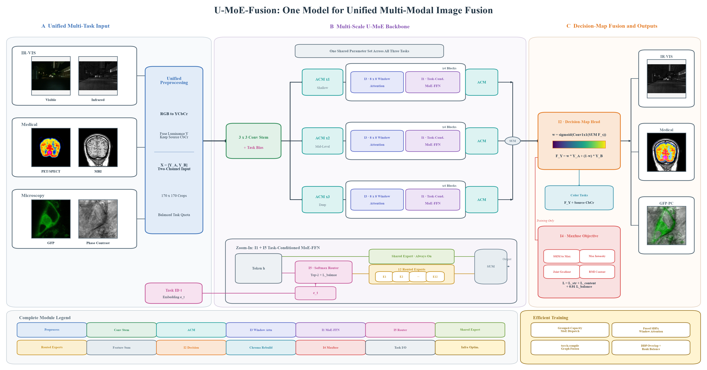
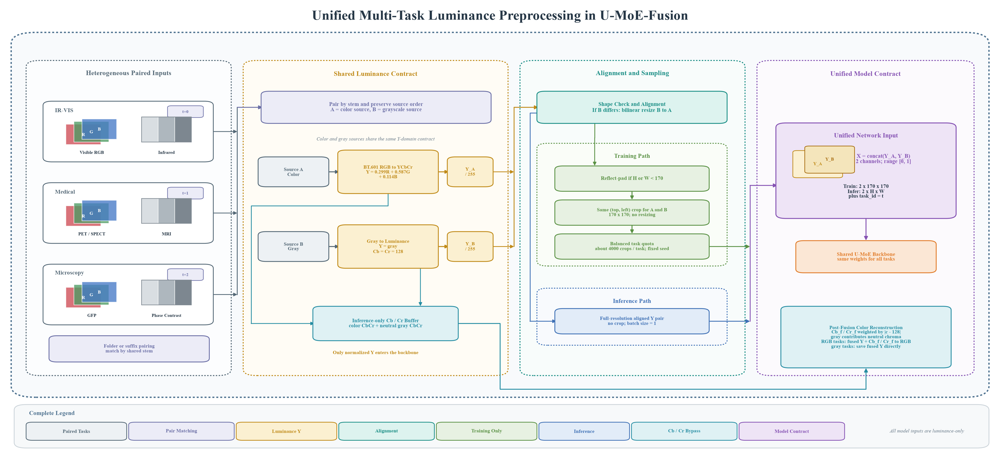
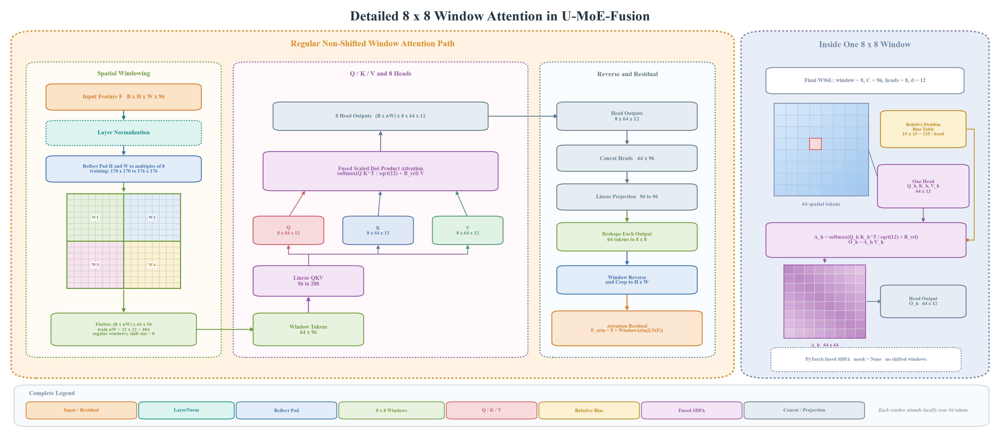
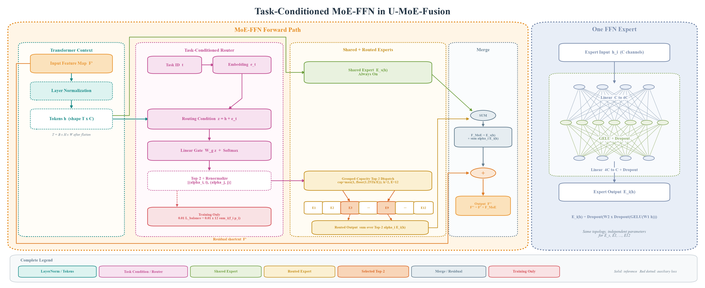
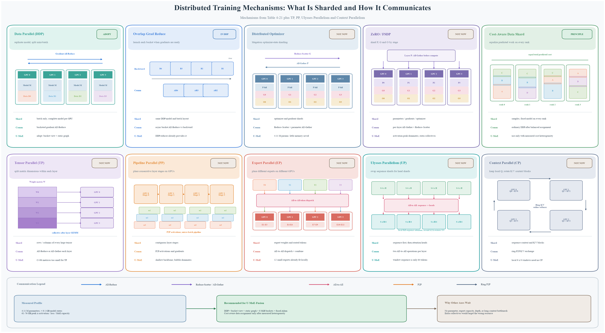

# U-MoE-Fusion 关键结构与训练机制图解

本节集中展示 U-MoE-Fusion 的总体框架、统一预处理、窗口注意力、任务条件 MoE-FFN，以及与模型特征相匹配的分布式训练机制。五幅图从数据进入网络开始，逐层展开核心计算模块，最后说明训练并行策略的选择依据。

## 1　U-MoE-Fusion 总体框架

> **图注｜U-MoE-Fusion 统一多模态图像融合总体框架。** 三类异构源图像经统一亮度预处理后进入一套共享的三分支多尺度主干；各 Transformer 块以 8×8 窗口注意力提取局部上下文，并通过任务条件 MoE-FFN 实现共享知识与任务特异知识的协同建模。三路特征汇聚后由像素级决策图完成双源亮度融合，彩色任务再利用源色度重建 RGB 输出。

整幅图应按 A、B、C 三个区域从左向右阅读：A 区解决“不同任务如何变成同一种网络输入”，B 区回答“同一套参数如何同时提取公共特征与任务特异特征”，C 区说明“特征如何转化为最终融合图像以及训练时如何施加约束”。底部的 Zoom-In 框是 B 区 Transformer 内部 MoE-FFN 的局部放大，高效训练条带则是执行层优化；二者分别补充网络语义和工程实现，但不改变 A→B→C 的主前向路径。

A 区列出三种有序输入对。IR–VIS 由可见光 RGB 与红外灰度图组成，Medical 由 PET/SPECT 功能伪彩图与 MRI 结构图组成，Microscopy 由 GFP 荧光图与 Phase Contrast 相位衬度图组成。三组任务在颜色、动态范围、空间分辨率和成像物理上均不相同，如果直接把 RGB、灰度和伪彩数据送入同一网络，通道语义会随任务改变，网络难以形成稳定接口。因此图中首先用 Unified Preprocessing 将差异吸收到网络外部，使主干始终接收含义一致的两路亮度。

预处理模块把彩色源从 RGB 转换到 YCbCr，只提取亮度 `Y_A`；灰度源本身作为 `Y_B`。二者归一化到 `[0,1]` 后按固定顺序拼接为 `X=[Y_A,Y_B]`，因而输入张量始终具有两个通道：第一个通道对应 Source A 的亮度，第二个通道对应 Source B 的亮度。彩色源的 Cb/Cr 被保存在主干之外，避免颜色差异干扰共享特征学习。训练时，两路源图使用完全相同的坐标裁取 170×170 区域且不缩放，并按任务配额平衡抽样；这样既维持像素级配准，又避免样本量更大的 MSRS 任务淹没医学或显微任务。

除了图像张量，A 区还把任务编号 `t` 送入任务嵌入层得到 `e_t`。需要强调的是，任务标识并不选择三套独立网络，也不改变卷积主干的权重；它只在 MoE 路由处作为条件信息参与专家分配。因此三类任务共享 stem、ACM、窗口注意力、专家集合和融合头，真正满足“一套权重、三类任务”，同时允许路由器针对不同任务形成不同的专家使用模式。

B 区首先使用 3×3 Conv Stem 将双通道亮度输入映射到统一的 96 通道特征空间，并叠加任务偏置。Stem 输出在分叉点被送入三条并行分支。上、中、下三路分别标为 Shallow、Mid-Level 和 Deep，其前端 ACM 数量依次为 1、2、3；这种差异使三条路径具有不同的有效感受野和非线性深度。浅层路径更容易保留边缘、纹理和局部亮度变化，中层路径关注区域结构，深层路径则聚合更大范围的上下文。三路不是三套任务网络，而是同一模型内部针对不同尺度的信息分解。

每条分支的核心都包含四个串联的 Transformer 块。块内左半部分是 I3 所表示的 8×8 Window Attention：特征被划分为非移位局部窗口，每个窗口内部执行多头注意力，以受控的计算量建立空间依赖。块内右半部分是 I1 所表示的 Task-Conditioned MoE-FFN：注意力输出经归一化后，一方面进入始终执行的共享专家，另一方面由 softmax 路由器从 12 个路由专家中选择 top-2。共享专家学习三类融合任务都需要的亮度、边缘和结构变换，稀疏专家则为红外目标、医学功能区或显微荧光等差异化模式提供额外容量。

Zoom-In 框进一步解释 I5 的作用。Token 特征 `h` 与任务嵌入 `e_t` 共同进入路由器，因此专家选择同时依赖“当前像素/区域呈现了什么内容”和“当前样本属于什么任务”。共享专家路径始终开启；路由路径只执行被选中的两个专家，并按归一化概率加权。两路结果在 SUM 节点相加形成 MoE 输出。图中任务嵌入到路由器的连线表示条件控制，而不是额外的图像特征分支；12 个专家下方只画出少数方框，是对完整专家集合和一次稀疏选择的示意。

三条分支在末端各经过一个 ACM 进行局部细化，然后在圆形 SUM 节点逐元素相加。这里的相加不是对三幅最终融合图做平均，而是在 96 通道特征域合并浅、中、深三种表征；合并后的特征仍保留空间布局，随后才进入决策图头。共享参数提示框强调同一组网络权重被所有任务复用，而 `×4 Blocks` 则表示每条分支中重复堆叠的 Transformer 深度，二者分别描述跨任务共享和分支内部深度。

C 区的 I2 Decision-Map Head 将汇聚特征经 1×1 卷积压缩为单通道 logits，再通过 sigmoid 得到范围位于 `[0,1]` 的像素级权重图 `w`。最终融合亮度按 `F_Y=w·Y_A+(1-w)·Y_B` 计算：当某位置的 `w` 接近 1 时更保留 Source A，接近 0 时更保留 Source B，中间值则表示两源的软组合。由于两个系数之和恒为 1，这一输出是逐像素凸组合，能够在保持输入亮度范围稳定的同时，让网络学习目标显著性、结构清晰度和纹理强度之间的取舍。

输出路径根据任务类型分流。IR–VIS 任务以融合 Y 作为灰度结果直接保存；Medical 和 Microscopy 属于彩色显示任务，融合 Y 会与预处理阶段保留的源 Cb/Cr 重新组合，再由 YCbCr 转回 RGB。右侧三张结果与左侧三组输入逐一对应，用于说明任务差异只影响输入契约、路由条件和颜色后处理，而中间的多尺度主干及决策图融合逻辑保持统一。

红色 I4 Maxfuse Objective 仅在训练阶段连接到融合结果。其强度项推动输出响应对齐两源中的较强信息，SSIM 项约束局部结构，联合梯度项鼓励保留两路源图的有效边缘，RMI content 项补充区域级内容关系。MoE 路由器还产生 `L_balance`，并以 0.01 的权重加入总损失，防止大量 token 长期集中到少数专家。前者约束“融合结果是否保留有用信息”，后者约束“模型容量是否被合理使用”，两类损失的作用对象不同。

最下方 Efficient Training 条带列出 grouped-capacity MoE dispatch、fused SDPA、`torch.compile` 图融合以及 DDP overlap/rank balance。Grouped-capacity 把不规则专家路由整理成规则批量矩阵乘，fused SDPA 合并注意力中的多个中间操作，`torch.compile` 减少 Python 与小算子开销，DDP overlap 则尽量把梯度通信隐藏在反向计算之后。它们只改变相同数学运算的组织和调度方式，因此被画在独立条带中，而没有接入上方推理箭头。

## 2　统一多任务亮度预处理

> **图注｜U-MoE-Fusion 的统一多任务亮度预处理流程。** 三类有序源对经文件配对、BT.601 亮度提取、尺寸对齐和 `[0,1]` 归一化后，被统一组织为双通道 Y 域输入；训练路径采用反射填充、同坐标 170×170 裁块和任务平衡采样，推理路径保留完整分辨率。源 Cb/Cr 仅通过推理旁路参与最终颜色重建。

该图把总体框架中的 Unified Preprocessing 展开为四个自左向右的区域：Heterogeneous Paired Inputs 负责建立正确的双源对应关系，Shared Luminance Contract 把颜色与灰度统一到同一亮度定义，Alignment and Sampling 根据训练或推理阶段组织空间尺寸，Unified Model Contract 则给出真正送入网络的张量及输出颜色重建方式。箭头颜色区分配对、亮度、训练、推理和色度旁路，因而阅读时应先沿中部亮度主线向右，再回看底部 Cb/Cr 旁路。

最左侧三张任务卡固定了 Source A、Source B 和 `task_id` 的语义。IR–VIS 中 A 是 Visible RGB、B 是 Infrared，对应 `t=0`；Medical 中 A 是 PET/SPECT 功能伪彩、B 是 MRI，对应 `t=1`；Microscopy 中 A 是 GFP 荧光、B 是 Phase Contrast，对应 `t=2`。这种顺序是模型接口的一部分，因为后续决策图中的 `w` 始终表示 Source A 的权重，`1-w` 始终表示 Source B 的权重。如果配对时交换源顺序，即使图像仍然成对，融合公式和颜色旁路的含义也会随之改变。

Folder or suffix pairing 模块说明数据集并不使用完全相同的目录命名规则。MSRS 和医学数据可以依据不同文件夹中的相同文件名配对，GFP–PC 则需要去除代表成像源的后缀，再用共同 stem 匹配。配对逻辑的目标不是寻找视觉上相似的两张图，而是恢复采集或整理阶段已经建立的同一场景、同一切片或同一视野对应关系。配对结果同时携带任务编号，保证图像张量与任务条件不会错位。

进入 Shared Luminance Contract 后，Source A 与 Source B 分别处理。彩色 Source A 使用 BT.601 全范围变换，其中亮度满足 `Y_A=0.299R+0.587G+0.114B`，Cb/Cr 则描述蓝色差和红色差色度；网络主路径只取 `Y_A`。灰度 Source B 不需要伪造 RGB 后再变换，而是直接把灰度值定义为 `Y_B`；若后续需要统一表示色度，则令其 `Cb=Cr=128`，即不携带任何颜色倾向。图中两条 `/255` 支路把 8-bit 亮度缩放到 `[0,1]`，使两源在数值范围上完全一致。

统一到 Y 域的关键意义是分离“需要学习的融合问题”和“无需主干学习的显示颜色”。红外、MRI 和相位衬度本来就是灰度结构信息，可见光、PET/SPECT 和 GFP 的颜色含义却彼此不同。若将这些颜色通道一起送入共享主干，网络可能把数据集特有配色当作任务捷径；只融合 Y 后，主干面对的始终是两路亮度、纹理和结构竞争，跨任务共享的目标更明确。色度没有被丢弃，而是由下方 Inference-only Cb/Cr Buffer 单独保存。

两路归一化亮度在进入裁样前先经过 Shape Check and Alignment。系统以 Source A 的高宽为目标，检查 Source B 是否与其一致；仅当形状不同，才用双线性插值把 B 对齐到 A。该步骤只纠正数组尺寸，不替代数据集本身的几何配准，也不会对已经同尺寸的图像重复缩放。推理阶段若 Source B 带有可用 Cb/Cr，其色度平面也使用相同目标尺寸，保证最终重建时 Y、Cb、Cr 像素一一对应。

绿色 Training Path 从对齐后的完整 Y 对开始。若任一空间边小于 170，先使用反射填充扩展到至少 170；反射填充延续边界附近的局部纹理，比常数黑边更不容易制造虚假强梯度。随后为一对源图随机生成同一个 `(top,left)`，从 `Y_A` 和 `Y_B` 取完全相同的 170×170 区域。这里明确“不缩放”：裁块改变视野范围但不改变局部像素间距，从而避免亮度、边缘和梯度损失的统计被插值扭曲。

训练路径最后执行 Balanced task quota。三个训练集规模差异明显，如果简单把全部样本混合，大数据集会在一个 epoch 中贡献更多梯度，路由器也可能把“出现频率”误当作“任务重要性”。因此系统为每个任务建立约 4000 个裁块的平衡索引，并固定随机种子，使不同任务在优化中的出现次数接近且实验可复现。平衡发生在任务采样层，而不是把同一张图机械复制成完全相同的 batch。

蓝色 Inference Path 不需要构造训练裁块。源对完成尺寸对齐和 `[0,1]` 归一化后，以批大小 1 保留完整分辨率，形成 `2×H×W` 输入。这样输出可以与原图逐像素对应，也不会因滑窗拼接引入接缝。训练输入则固定为 `2×170×170`，便于形成规则 batch 并控制显存。虽然空间尺寸不同，两条路径的通道顺序、数值范围和 `task_id` 定义完全相同，所以训练得到的同一套卷积和 Transformer 权重可以直接用于任意合法分辨率的推理。

Unified Network Input 框汇总了模型边界处的最终契约：`X=concat(Y_A,Y_B)`，通道数恒为 2，取值范围恒为 `[0,1]`，并额外传入标量任务编号 `t`。图中的两个叠放平面不是两张独立样本，而是同一样本的两个输入通道。Shared U-MoE Backbone 对三类任务使用同一组参数；任务编号只在任务嵌入和 MoE 路由中发挥作用，不能改变输入通道的含义。

底部青色 Cb/Cr 线路完全绕过训练主干。对于某个色度分量 `c`，重建时按其偏离中性值 128 的绝对幅度计算贡献：饱和度更高、颜色证据更强的一路获得更大权重；灰度源因为 `c=128`，其偏离量为 0，不会给结果染色。得到 `Cb_f、Cr_f` 后，RGB 任务使用 `(fused Y,Cb_f,Cr_f)` 做 YCbCr→RGB 逆变换，灰度任务则直接保存 fused Y。由此可以看出，网络预测负责“每个位置保留哪一路结构与亮度”，色度旁路负责“彩色任务最终以什么颜色显示”，两者在逻辑上相互独立。

## 3　8×8 窗口注意力

> **图注｜U-MoE-Fusion 中 8×8 窗口注意力的详细结构。** 输入特征经 LayerNorm 和反射填充后被划分为非移位 8×8 窗口，每窗 64 个 token 通过八头 Q/K/V 投影和带二维相对位置偏置的 fused SDPA 建模局部空间关系；多头输出经拼接、线性投影、窗口还原和裁剪后，与原始特征进行残差相加。

该图由左侧的完整前向路径和右侧的单窗口放大图组成。左侧依次展示 Spatial Windowing、Q/K/V and 8 Heads、Reverse and Residual 三个阶段，回答特征如何被分窗、如何在窗内计算注意力、以及如何恢复到原空间。右侧不表示另一条并行网络，而是把左侧任意一个 8×8 窗口内部的通道数、头维度、相对位置偏置和注意力矩阵单独放大，便于理解 fused SDPA 中被折叠的计算。

模块输入为 `F∈R^{B×C×H×W}`，最终 W96L 配置取 `C=96`。实现先把特征重排为 `(B,H,W,C)`，使 LayerNorm 沿最后一个通道维对每个空间位置独立归一化。LayerNorm 不混合不同像素，只把同一位置的 96 个通道调整到稳定分布；它的输出才进入 Q/K/V 投影，而残差 shortcut 保存的是注意力分支之外的原始 F。

窗口划分要求高宽都是 8 的整数倍，因此图中在 LayerNorm 后执行 Reflect Pad。填充量分别为 `pad_h=(8-H mod 8) mod 8` 和 `pad_w=(8-W mod 8) mod 8`，只添加在右侧与下侧；若某一维本来已整除 8，则该维填充量为 0。反射模式复制边界附近的空间变化，而不是加入常数边框，能够减少窗口边缘出现异常响应。填充尺寸会被记录下来，以便注意力结束后精确裁回原始 H、W。

以训练使用的 170×170 特征图为例，两边都需补 6 个位置，得到 176×176。随后按 8×8 网格划分为 `22×22=484` 个互不重叠窗口。每个窗口含 64 个空间位置，展平后得到 `(64,96)` token 序列；把 batch 和窗口编号合并后，实际送入注意力的形状是 `(B·nW,64,96)`。窗口划分只改变张量的排列方式，不进行下采样，因此 64 个 token 与原 8×8 区域中的像素位置保持一一对应。

图中 W1、W2、W3、W4 代表规则平铺的相邻窗口，并强调当前配置是 non-shifted window。也就是说，模块没有执行 Swin Transformer 中的循环移位，窗口之间也不构造跨边界 attention mask，`shift_size=0、mask=None`。一个注意力层内，token 只与同一窗口的另外 63 个位置交互；跨窗口信息主要依靠前后 ACM 的卷积邻域与三分支特征汇聚间接传播，重复窗口块本身仍保持相同的局部边界。这样把全图二次复杂度限制为许多固定 64×64 的局部注意力计算。

每个 `(64,96)` 窗口首先经过 Linear QKV，将最后一维从 96 一次性投影到 `3C=288`。投影结果再拆分为 Q、K、V，并按 8 个头重排为 `(8,64,12)`，因为单头维度 `d=96/8=12`。图中三个竖直箭头表示 Q、K、V 来自同一个窗口和同一个线性投影，但在 SDPA 中承担不同作用：Q 表示当前 token 发出的查询，K 表示可匹配的内容索引，V 表示匹配后要聚合的信息。

右侧浅蓝 8×8 网格展示一个窗口的 64 个空间 token。对于任意两个 token，其行坐标差和列坐标差都位于 `[-7,7]`，所以二维相对位移共有 `(2·8-1)^2=15×15=225` 种。模型为每个注意力头学习这 225 个偏置值，再使用预先构造的 relative position index，把每一对 query/key 的二维位移映射到对应偏置。最终得到的 `B_rel` 与注意力 logits 一样都是 64×64，其中行表示 query 位置，列表示 key 位置。

单头注意力首先计算 `Q_hK_h^T`，得到 64×64 的相关性矩阵，再除以 `√12` 控制数值尺度并加上相对位置偏置 `B_rel`。沿 key 维执行 softmax 后得到 `A_h`，其每一行表示一个 query 对窗口内 64 个位置的归一化权重；再通过 `O_h=A_hV_h` 聚合 value，输出形状仍为 64×12。右下紫色矩阵就是 `A_h` 的示意，颜色深浅代表某个位置对其他位置分配的注意力强弱，而不是输入图像的灰度值。

实现并未显式保存图中每一个中间矩阵，而是调用 PyTorch fused scaled dot-product attention。该内核在保持 `softmax(QK^T/√d+B_rel)V` 数学语义不变的前提下，融合缩放、加偏置、softmax、dropout 和 value 聚合，并在支持的 GPU 上选择 FlashAttention 或 memory-efficient 路径。图底部的 `mask=None` 再次说明这里没有 shifted-window mask；相对位置偏置作为加性 attention bias 提供窗口内的几何先验。

八个头各自产生 `(64,12)` 输出，先沿通道维拼接为 `(64,96)`，再通过 Linear Projection `96→96` 进行头间信息混合。随后 Reshape Each Output 把每组 64 token 还原为 8×8×96，Window Reverse 根据原窗口网格位置把所有局部块拼回填充后的整幅特征图。该过程是窗口划分的严格逆操作，既不平均重叠区域，也不改变空间顺序，因为这些窗口本身互不重叠。

如果前面发生过填充，恢复后的特征会从右侧和下侧裁掉新增区域，重新得到 `(B,H,W,96)`，并转回主干所需的布局。注意力分支输出与 shortcut 逐元素相加，形成 `F_attn=F+WindowAttention(LayerNorm(F))`。残差连接让模块只需学习相对原特征的增量，既保留卷积主干已有的局部信息，也改善深层堆叠中的梯度传播。该结果随后进入第二个 LayerNorm 和 MoE-FFN，因此窗口注意力负责空间位置间的信息交换，MoE-FFN 负责每个 token 的通道变换和任务条件专家选择。

## 4　任务条件 MoE-FFN

> **图注｜U-MoE-Fusion 中任务条件 MoE-FFN 的详细结构。** 归一化 token 与任务嵌入共同生成 softmax 路由概率，一个共享专家对全部 token 常开，12 个路由专家中仅 top-2 被稀疏激活并按归一化权重汇聚；路由输出与共享专家输出相加后再通过残差连接返回 Transformer 主路径，右侧给出单个 `C→4C→C` FFN 专家的内部结构。

图的左侧大框是一个完整 MoE-FFN 前向过程，按 Transformer Context、Task-Conditioned Router、Shared + Routed Experts、Merge 四个分区从左向右阅读；最左下方的长旁路是残差 shortcut。右侧 One FFN Expert 则把任意一个共享或路由专家的内部网络放大。两部分的关系是“专家集合如何被调用”和“单个专家内部做什么变换”，并不是两个串联的额外模块。

Transformer Context 接收窗口注意力之后的特征 `F'`。第二个 LayerNorm 对每个空间位置的 C 维通道进行归一化，再把空间维展平为 token 序列 `h`；总 token 数记为 `T=B×H×W`，所以路由器看到的基本形状是 `(T,C)`。展平只用于把每个空间位置作为独立路由单位，专家输出完成后仍会恢复原来的 batch 与 H、W 布局。原始 `F'` 同时保留在残差旁路中，不参与路由概率计算。

Router 上方从 Task ID `t` 开始。任务嵌入层把离散编号映射为 C 维向量 `e_t`，同一张图中的所有空间 token 共享该任务向量。实现通过广播形成 `z=h+e_t`，再将 z 输入线性门控 `W_g`。因此路由 logits 不是只由任务决定：`h` 仍描述当前 token 的内容，`e_t` 则整体平移路由条件，使相似局部结构在 IR–VIS、Medical 或 Microscopy 中可以获得不同的专家偏好。

线性门控为每个 token 产生 12 个 logits，softmax 将其转换为总和为 1 的专家概率 `p_i`。Top-2 操作保留概率最大的两个专家索引及其权重，舍去其余十个分支；随后再次归一化两个保留权重，使 `α_i+α_j=1`。这一重归一化很重要，因为最终路由输出是两个专家结果的加权和，如果直接保留原始 softmax 值，被删除的十个专家概率质量会让路由分支整体幅度无规则减小。

共享专家路径从 token h 直接绕过路由器进入 `E_s(h)`，并对每个 token 始终执行。它提供一个不会因 top-2 离散选择而中断的公共变换通道，用于承载三类任务都需要的亮度、结构和局部纹理处理。绿色路径不带路由权重，也不占用 12 个路由专家的 top-2 名额；因此每个 token 的有效计算由一个共享专家和两个被选路由专家共同组成。

路由专家区包含 `E1…E12`，这些专家拓扑相同但参数独立。图中 E3 与 E9 的橙色高亮只演示某个 token 的一次选择：另一个 token 可能选择完全不同的两项，同一任务在不同图像区域也无需固定使用同一专家。被选专家分别计算 `E_i(h)`，再乘以归一化系数 `α_i`。Routed Output 中的求和只覆盖该 token 的 top-2，而不是把 12 个专家全部执行后再筛选，因此稀疏路由带来的容量增长不会按专家总数线性增加计算量。

Grouped-Capacity Top-2 Dispatch 展示了从逻辑路由到高效张量计算的转换。若逐 token 调用 Python 子模块，专家选择会形成大量尺寸很小且不规则的运算；grouped 实现先依据专家索引重新排列 token，把发往同一专家的数据装入固定容量槽。容量为 `cap=max(1,floor(1.25·T·k/E))`，其中 `k=2、E=12`，系数 1.25 为路由不均衡预留冗余。整理后，各专家的 `C→4C→C` 变换可以使用规则的批量 GEMM 执行，再依据原 token 索引把结果散射回去。

Merge 区的第一个 SUM 将共享专家输出与路由专家加权输出合并，数学形式为 `F_MoE=E_s(h)+Σ_{i∈Top-2}α_iE_i(h)`。这里先在 token 维保持一一对应，再恢复为原来的空间特征图；不同 token 之间不会在该求和节点互相混合。得到的 `F_MoE` 经过下方残差加法节点与 `F'` 相加，形成 `F''=F'+F_MoE`，然后返回 Transformer 主路径。图底部长线之所以绕过 Router 和 Experts，是为了明确残差保存的是模块输入本身，而不是共享专家的另一份输出。

右侧专家放大图说明 `E_s、E1…E12` 都采用标准两层 FFN。第一层 Linear 将通道从 C 扩展到 4C，在最终 `C=96` 配置中即 `96→384`；GELU 提供非线性，Dropout 用于正则化；第二层 Linear 再将 `384→96`，随后经过第二个 Dropout。各专家的节点连接形状相同，但权重矩阵互不共享，因而可以学习不同的通道变换。当前配置中若 `drop=0`，Dropout 在数值上等价于恒等映射，图中仍保留它是为了完整呈现模块定义。

Router 下方的红色 Training Only 分支计算负载均衡辅助项。`f_i` 表示 top-2 离散选择中专家 i 接收的 token 比例，`p_i` 表示 softmax 对专家 i 的平均概率，`L_balance=12Σ_i(f_i·p_i)` 同时关注实际分配与连续路由倾向。如果少数专家长期同时具有高概率和高接收量，该项会增大；以 0.01 的权重加入总损失后，可在不过度干扰主融合目标的前提下抑制路由塌缩。红色虚线到此结束，是因为推理时不需要计算或返回这项损失。

从功能分工看，共享专家保证跨任务知识迁移和稳定底座，路由专家提供额外的任务/内容条件容量，任务嵌入让路由器知道当前融合场景，残差连接则保证即使专家变换尚未学好，原始特征仍可继续传播。四者共同解释了该模块为何不是简单地把普通 FFN 复制 12 份：它同时规定了专家选择、共享与特化、稀疏执行、结果合并以及训练稳定性约束。

## 5　分布式训练机制比较

> **图注｜分布式训练机制的切分对象、通信模式及其与 U-MoE-Fusion 的匹配关系。** 图中以统一的四卡示意比较 DDP、梯度归约重叠、分布式优化器、ZeRO/FSDP、成本感知数据分片、TP、PP、EP、Ulysses Parallelism 和 Context Parallelism，并分别标出其切分对象、主要通信操作以及对当前轻量级、激活主导模型的适用性。

这幅图不是把并行方法按“先进程度”排序，而是用统一尺度比较它们各自在切什么、为什么通信以及解决哪一种资源瓶颈。十张卡片均以四个 GPU/rank 为例，并在底部给出通信图例：All-Reduce 用于让各 rank 获得相同的归约结果，Reduce-Scatter 在归约同时把结果分片，All-Gather 收集各 rank 的分片，All-to-All 让每个 rank 同时向所有其他 rank 交换不同数据，P2P 和 Ring P2P 则用于相邻 stage 或上下文块的点对点传输。判断某种并行是否合适，不能只看它能否降低某一项显存，而要比较节省量、通信频率、消息大小和可被隐藏的计算量。

PyTorch DDP 切分的是数据。四张 GPU 都保存完整模型、完整优化器和相同的初始参数，每个 rank 处理不同 mini-batch；前向和反向计算主要在本地完成，当某个参数得到梯度后，各 rank 通过 All-Reduce 求和或平均，确保更新前梯度一致。DDP 不降低单卡模型状态显存，但其控制流简单、每步通信量近似与参数规模成正比。U-MoE-Fusion 只有约 4.11 M 参数，因此梯度通信相对较小，而不同 rank 可以并行处理更多图像裁块，数据并行正好对应提升吞吐的目标。

Overlap Grad Reduce 卡片描述的是 DDP 内部的时间调度，而不是第十一种切分轴。反向传播按从后层到前层的顺序产生梯度；DDP 将参数组织成若干 bucket，当一个 bucket 的梯度全部就绪时便异步发起 All-Reduce，同时 GPU 继续计算更前面网络层的反向。理想情况下，早期 bucket 的通信被后续反向计算覆盖，只在最后一个 bucket 留下可见等待。当前配置使用约 8 MiB 的两桶、`gradient_as_bucket_view=True` 和 static graph，前者控制启动时机，bucket view 避免额外梯度拷贝，静态图则让 reducer 能稳定复用相同的就绪顺序。

Megatron Distributed Optimizer 仍建立在数据并行组上，但进一步切分归约后的梯度和优化器状态。普通 All-Reduce 让每个 rank 都得到完整梯度；分布式优化器改用 Reduce-Scatter，使每个 rank 只保留自己负责的参数分片对应梯度，并只更新该部分 Adam 一阶、二阶状态。下一次计算需要完整参数时，再通过 All-Gather 组合各 rank 更新后的参数片段。它用额外的参数收集换取状态显存下降，适合优化器状态达到数十或数百 GB 的大模型；当前模型全部 FP32 参数、梯度和 Adam 状态合计仍不足 0.1 GB，切分后释放的空间无法显著改变 61–76 GB 的训练峰值。

ZeRO/FSDP 卡片把状态切分推得更彻底。不同 ZeRO stage 可依次切分优化器状态、梯度和参数，FSDP 通常在某个模块前 All-Gather 其参数执行前向，在反向后 Reduce-Scatter 梯度并释放不再需要的完整参数。这样单卡不必常驻整个大模型，但每层或每组层都会出现参数物化与回收。U-MoE-Fusion 的峰值主要由中间激活、融合损失分支以及 grouped-MoE 容量缓冲造成，这些张量不会因切分 4.11 M 参数而消失；反而更细粒度的 All-Gather/Reduce-Scatter 可能给短小网络增加同步点。

Cost-Aware Data Shard 与前几种方法不同，它既不切模型状态，也不改变 DDP 的梯度通信。其逻辑是在组成各 rank 的 mini-batch 前，为样本估计成本，例如依据分辨率、token 数、任务类型或历史步时，然后让每个 rank 获得的预计总成本接近。该方法只在样本计算量存在可预测异构时有价值：如果某个 rank 总是拿到更慢样本，其他 rank 会在同步点空等；重新分片可以缩短尾部等待。但当前训练裁块固定为 170×170，按任务标签做平衡并不等于按真实耗时平衡，实验未观察到稳定成本差异时，不应仅因存在三类任务就引入复杂调度。

Tensor Parallel（TP）切分的是单层内部的大矩阵。例如一个线性层可以按输出列或输入行把权重放到不同 GPU，每张卡只计算部分通道，之后通过 All-Reduce 或 All-Gather 合并完整结果。它能让单个超宽层突破单卡容量，却会在许多层内产生 collective，且小矩阵切分后每张卡的 GEMM 更小，硬件利用率可能下降。本文主干宽度仅 `C=96`，专家内部最大扩展到 `4C=384`，这些矩阵单卡轻松容纳；把它们拆到四卡后，通信启动延迟很可能高于节省的计算时间。

Pipeline Parallel（PP）沿网络深度切分连续层。图中的 GPU0–GPU3 分别代表不同 stage，前向激活按顺序通过 P2P 发送，反向梯度再逆序返回。为避免只有一个 stage 工作，训练会把 batch 拆为多个 micro-batch 交错进入流水线；即便如此，填充和排空阶段仍形成 pipeline bubble，stage 计算不均衡也会造成等待。U-MoE-Fusion 的分支和 Transformer 深度较浅，每个 stage 可分到的连续计算不足，且跨 stage 传输二维激活的代价相对模型参数更大，因此没有足够计算去摊薄气泡与 P2P 开销。

Expert Parallel（EP）切分的是 MoE 专家。不同 GPU 只保存部分专家，Router 在本地得到 top-2 索引后，第一次 All-to-All 把 token 发送到专家所在 GPU；各卡完成专家 FFN 后，第二次 All-to-All 将输出送回 token 原属 rank，再按路由权重合并。EP 对“专家参数很多、单卡放不下或专家 GEMM 足够大”的模型非常有效，但它也把每个 MoE 层变成两次全局 token 交换。本文只有 12 个小专家，能够全部驻留单卡并通过 grouped-capacity 执行规则批量 GEMM；使用 EP 会把快速本地重排变成网络通信，且 top-2 分布不均还可能造成通信与计算负载倾斜。

Ulysses Parallelism（UP）面向超长序列注意力。初始状态下，每个 rank 保存 `S/P` 段序列和全部注意力头；第一次 All-to-All 重新布局，使每个 rank 获得完整长度 S、但只负责 `H/P` 个头，于是本地可对完整序列执行一部分多头注意力；第二次 All-to-All 再恢复序列分片布局。该方法降低每卡序列激活占用，但要求头数可被并行度合理切分，并支付两次全互换。本文注意力已在空间上切成 8×8 窗口，单窗 `S=64`、总头数 `H=8`，既不存在超长序列，也没有足够大的单头计算去隐藏 All-to-All。

Context Parallel（CP）同样服务于长上下文，但保留本地 query，只让不同 rank 持有 K/V 的上下文片段。计算时，各 rank 沿环形 P2P 轮转 K/V 块；每收到一块，就计算局部 logits，并通过在线 softmax 累积全上下文结果，直到所有块都被访问。它避免一次性复制完整 K/V，却引入多轮相邻通信和严格的计算—通信流水。U-MoE-Fusion 的每个 query 本来只需要访问同一 8×8 窗口内 64 个 key/value，局部 K/V 已远小于单卡容量，再跨 GPU 切分只会破坏 fused SDPA 的规则本地计算。

把十种机制放在一起，可以看到它们针对的是完全不同的“过大对象”：Distributed Optimizer 和 ZeRO/FSDP 针对模型状态，TP 针对单层矩阵，PP 针对网络深度，EP 针对专家集合，UP/CP 针对序列或上下文，Cost-Aware Shard 针对样本耗时差异。U-MoE-Fusion 当前真正大的对象是激活和训练期临时缓冲，而不是参数、单层、专家或单窗序列。因此“能切分更多内容”并不等于“更适合本模型”，额外并行轴若没有命中主瓶颈，只会增加同步和数据搬运。

图底部最终选择由上述资源构成直接推出：采用 **DDP + 异步分桶重叠 + gradient bucket view + static graph + 约 8 MiB 两桶 + fused Adam**。DDP 让八张 H800 同时处理不同数据，分桶重叠尽量把小规模梯度通信隐藏在反向计算中，bucket view 与 fused Adam 减少本地内存和优化器开销；模型、专家和窗口注意力仍在单卡内保持规则执行。若未来模型宽度、专家数量、序列长度或样本成本分布发生数量级变化，图中的其他并行轴可以重新评估，但在当前配置下不引入它们是基于瓶颈匹配，而不是缺少实现能力。
